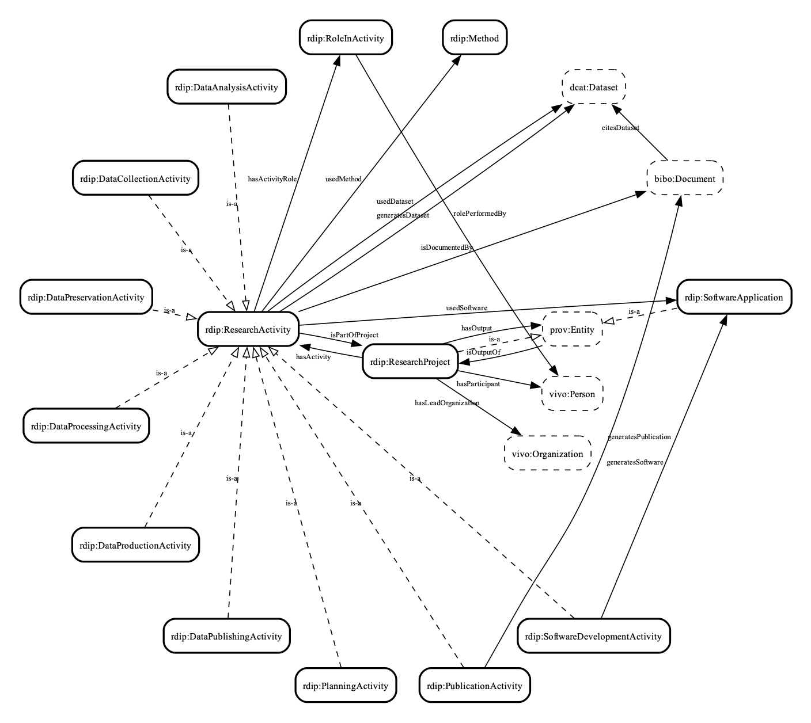

# Research Data Intelligence Platform (RDIP) Ontology

[](https://opensource.org/licenses/MIT)
[](https://open-rdip.github.io/core-ontology/)

> **A project-centric knowledge model designed as a target schema for AI-driven research provenance.**

## Quick Links
- ** [HTML Documentation](https://open-rdip.github.io/core-ontology/)**: Browse classes, properties, and visualizations.
- ** [Ontology File (Turtle)](ontology/rdip.ttl)**: The raw source code.

---

## Overview

The **RDIP Ontology** addresses the fragmentation of scholarly knowledge by shifting the focus from isolated documents to the **Research Project** itself. Unlike generic schemas (e.g., Schema.org) which are often too permissive for generative AI, RDIP provides a strict `Project → Activity → Software` skeleton.

This strict structure acts as a **semantic guardrail**, preventing Large Language Models (LLMs) from hallucinating invalid relationships when extracting metadata from unstructured texts.

### Key Features
- **Project-Centric:** Uses `rdip:ResearchProject` as the central hub connecting agents, outputs, and funding.
- **Provenance-Aware:** Elevates software versions and computational methods to first-class entities.
- **LLM-Ready:** Designed explicitly as a target schema for automated knowledge graph construction.



---

##  Repository Structure

This repository contains the ontology source, documentation, and the full evaluation datasets used.

```text
.
├── ontology/               # The core RDIP ontology source files
│   ├── rdip.ttl            # MASTER FILE: The ontology definition
│   └── examples.ttl        # Instance data examples
│
├── docs/                   # Full HTML documentation (generated using Widoco)
│
├── evaluation/             # Reproducibility materials for the LLM experiment
│   ├── prompts/            # The exact prompts used (Standard vs. RDIP-Injected)
│   ├── ground_truth/       # Manually curated "Gold Standard" datasets (N=12)
│   ├── llm_outputs/        # Raw JSON-LD outputs from the LLM
│   └── scripts/            # Python scripts
│
├── assets/                 # Supplementary materials
│   ├── competency_questions.md  # List of CQs and SPARQL queries
│   └── case_studies/            # Visualizations of the case studies
│
└── LICENSE                 # MIT License
```

## Evaluation & Reproducibility

To ensure transparency and reproducibility (addressing the "black box" nature of LLM evaluations), we provide all artifacts used in our comparative study:

1. Prompts: We compare a Baseline Prompt (using standard DCAT terms) against the RDIP Prompt (schema-injected).

    - [View Baseline Prompt](evaluation/prompts/prompt_dcat.md)

    - [View RDIP Prompt](evaluation/prompts/prompt_rdip.md)

2. Ground Truth: Expert annotators manually extracted metadata from 12 diverse research papers to create the Ground Truth.

    - [View Ground Truth Data](evaluation/ground_truth/ground_truth.xlsx)

3. Results: The raw output files generated by the LLM for both conditions are available.

    - [View Raw LLM Outputs](evaluation/llm_outputs/)


## Usage

## Usage

### Permanent URI
The ontology is identified by the permanent URI:
**`https://w3id.org/rdip`**

### Import into Protégé
Because this URI is permanently resolvable, you can import it directly without downloading files:
1. Open **Protégé**.
2. Select **File** $\to$ **Import...**
3. Select **"Import an ontology contained in a document located at the URI"**.
4. Enter: `https://w3id.org/rdip`

### Verifying Content Negotiation (Test via CLI)
You can verify that the URI correctly redirects to the machine-readable Turtle file using `curl`:

```bash
# Request the Turtle file explicitly
curl -L -H "Accept: text/turtle" [https://w3id.org/rdip](https://w3id.org/rdip)
```

## License
This project is licensed under the MIT License - see the [LICENSE](LICENSE) file for details.
