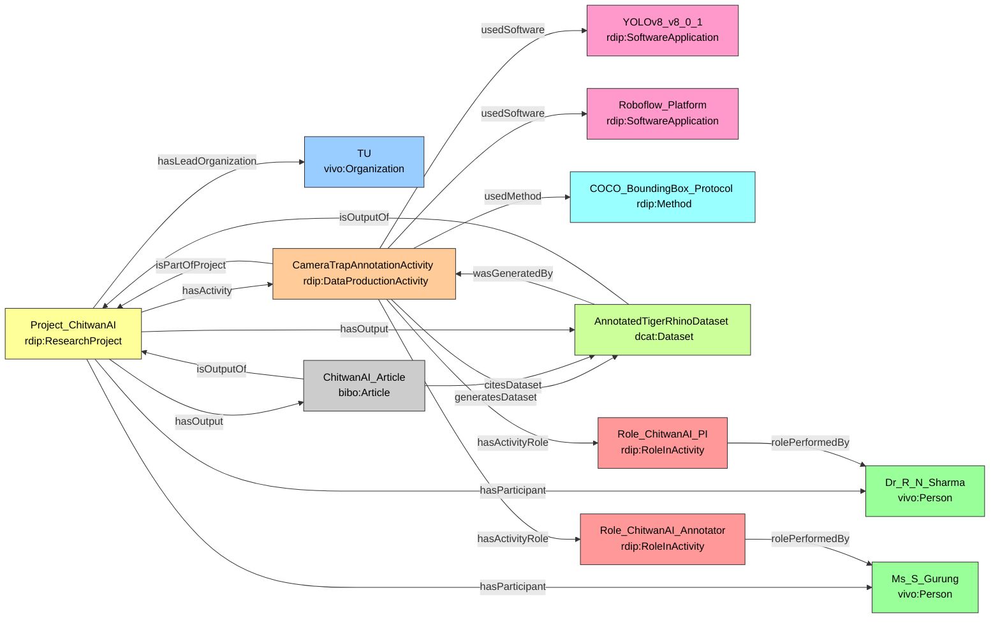

# Case Study 1 — Computer Science
## Automated Wildlife Monitoring in Chitwan National Park using YOLOv8
---

## Prefixes

```sparql
PREFIX rdip:    <https://w3id.org/rdip/>
PREFIX ex:      <https://w3id.org/rdip/examples/>
PREFIX vivo:    <http://vivoweb.org/ontology/core#>
PREFIX bibo:    <http://purl.org/ontology/bibo/>
PREFIX dcat:    <http://www.w3.org/ns/dcat#>
PREFIX prov:    <http://www.w3.org/ns/prov#>
PREFIX cito:    <http://purl.org/spar/cito/>
PREFIX rdfs:    <http://www.w3.org/2000/01/rdf-schema#>
PREFIX xsd:     <http://www.w3.org/2001/XMLSchema#>
PREFIX dcterms: <http://purl.org/dc/terms/>
```

**Fictional publication:** Sharma, R., & Gurung, S. (2024). A YOLOv8-based System for Real-time Tiger and Rhino Detection from Camera Traps. *IEEE Transactions on Pattern Analysis and Machine Intelligence*, 46(11), 1234–1245.

---

### 1. Modeling the Project and Team

The initiative is the central hub, modeled as `rdip:ResearchProject`.

**Key design decisions:**

- `rdip:ResearchProject` is the core aggregating class; it holds the RAiD persistent identifier (PID) directly on the project, making the project itself Findable (FAIR F).
- Team roles are expressed using `rdip:RoleInActivity` instances attached to the annotation activity, allowing specific attribution of "who did what" — distinguishing Principal Investigator from Data Annotator in a way that is directly SPARQL-queryable.
- ORCID iDs on persons ensure researcher disambiguation (FAIR F).

```turtle
# Organization
ex:TU a vivo:Organization ;
    rdfs:label "Tribhuvan University" .

# Project
ex:Project_ChitwanAI a rdip:ResearchProject ;
    rdip:title            "ChitwanAI: Camera-trap wildlife detection in Nepal" ;
    rdip:identifier       "https://raid.org/10.9876/raid.2023.011" ;
    rdip:description      "Deep learning project using camera-trap images from Chitwan National Park to detect tigers and rhinos." ;
    rdip:hasLeadOrganization ex:TU ;
    rdip:projectStart     "2025-01-01T00:00:00"^^xsd:dateTime ;
    rdip:projectEnd       "2025-12-31T00:00:00"^^xsd:dateTime .

# People
ex:Dr_R_N_Sharma a vivo:Person ;
    rdfs:label   "Dr. R. N. Sharma" ;
    rdip:orcidId <https://orcid.org/0000-0002-1234-5678> .

ex:Ms_S_Gurung a vivo:Person ;
    rdfs:label "Ms. S. Gurung" .
```

---

### 2. Modeling Data Production and Provenance

The core process is an instance of `rdip:DataProductionActivity` — more specific than the bare `prov:Activity`, it expresses that this is the process that *produced* the data.

**Key design decisions:**

- `rdip:isPartOfProject` creates the critical provenance chain: dataset → activity → project.
- Software is modeled as a class (`rdip:SoftwareApplication`), not a plain string, so version metadata can be attached. Without the version, another researcher cannot reproduce the experiment (FAIR R).
- The formal annotation protocol is a separate `rdip:Method` instance — capturing *how* the work was done, distinct from *what tool* was used.

```turtle
# Software
ex:YOLOv8_v8_0_1 a rdip:SoftwareApplication ;
    rdip:title      "Ultralytics YOLOv8" ;
    rdip:version    "8.0.1" ;
    rdip:identifier "https://github.com/ultralytics/ultralytics" .

ex:Roboflow_Platform a rdip:SoftwareApplication ;
    rdip:title   "Roboflow" ;
    rdip:version "web-2025-01" ;
    rdip:identifier "https://roboflow.com/" .

# Method
ex:COCO_BoundingBox_Protocol a rdip:Method ;
    rdip:title       "COCO-style bounding box annotation protocol" ;
    rdip:description "Object detection annotation using COCO conventions for class labels and bounding boxes." .

# Activity
ex:CameraTrapAnnotationActivity a rdip:DataProductionActivity ;
    rdip:title               "Camera-trap image annotation and YOLOv8 training" ;
    rdip:activityDescription "Annotating tiger and rhino images with COCO bounding boxes and preparing training data for YOLOv8." ;
    rdip:isPartOfProject     ex:Project_ChitwanAI ;
    rdip:usedSoftware        ex:YOLOv8_v8_0_1 , ex:Roboflow_Platform ;
    rdip:usedMethod          ex:COCO_BoundingBox_Protocol ;
    rdip:generatesDataset    ex:AnnotatedTigerRhinoDataset ;
    rdip:activityStart       "2025-04-01T09:00:00"^^xsd:dateTime ;
    rdip:activityEnd         "2025-06-30T17:00:00"^^xsd:dateTime .

# Roles
ex:Role_ChitwanAI_PI a rdip:RoleInActivity ;
    rdip:roleLabel       "Principal Investigator" ;
    rdip:rolePerformedBy ex:Dr_R_N_Sharma .

ex:Role_ChitwanAI_Annotator a rdip:RoleInActivity ;
    rdip:roleLabel       "Data Annotator" ;
    rdip:rolePerformedBy ex:Ms_S_Gurung .

ex:CameraTrapAnnotationActivity
    rdip:hasActivityRole ex:Role_ChitwanAI_PI ,
                         ex:Role_ChitwanAI_Annotator .
```

---

### 3. Modeling Outputs and Connections

**Key design decisions:**

- `dcat:Dataset` is the W3C standard for data catalog entries; the DOI makes the dataset persistently Findable and Accessible (FAIR F, A).
- `prov:wasGeneratedBy` is the standard PROV-O link from output (dataset) to process (activity) — completing the provenance trace.
- `cito:citesAsDataSource` (via `rdip:citesDataset`) provides semantically precise, interoperable data citation (FAIR I).

```turtle
# Dataset
ex:AnnotatedTigerRhinoDataset a dcat:Dataset ;
    rdip:title       "Annotated tiger and rhino bounding boxes" ;
    rdip:identifier  "https://doi.org/10.5678/zenodo.11111" ;
    rdip:version     "1.0.0" ;
    rdip:accessLevel "open" ;
    rdip:landingPage <https://example.org/chitwanai/dataset> ;
    prov:wasGeneratedBy ex:CameraTrapAnnotationActivity ;
    rdip:isOutputOf  ex:Project_ChitwanAI .

# Publication
ex:ChitwanAI_Article a bibo:Article ;
    rdip:title      "A YOLOv8-based System for Real-time Tiger and Rhino Detection from Camera Traps" ;
    rdip:identifier "https://doi.org/10.1109/TPAMI.2024.11111" ;
    rdip:citesDataset ex:AnnotatedTigerRhinoDataset ;
    rdip:isOutputOf ex:Project_ChitwanAI .

# Project aggregation
ex:Project_ChitwanAI
    rdip:hasActivity    ex:CameraTrapAnnotationActivity ;
    rdip:hasOutput      ex:AnnotatedTigerRhinoDataset ,
                        ex:ChitwanAI_Article ;
    rdip:hasParticipant ex:Dr_R_N_Sharma ,
                        ex:Ms_S_Gurung .
```

---

### Competency Question Answers — Case Study 1

#### CQ1: Which software (and version) was used to generate the dataset?

| Dataset | Activity | Software | Version |
|---|---|---|---|
| Annotated tiger and rhino bounding boxes | Camera-trap image annotation and YOLOv8 training | Ultralytics YOLOv8 | 8.0.1 |
| Annotated tiger and rhino bounding boxes | Camera-trap image annotation and YOLOv8 training | Roboflow | web-2025-01 |

**Traceability path:** `ex:AnnotatedTigerRhinoDataset` → `prov:wasGeneratedBy` → `ex:CameraTrapAnnotationActivity` → `rdip:usedSoftware` → `ex:YOLOv8_v8_0_1` / `ex:Roboflow_Platform`

---

#### CQ2: Which formal methods were used in the data production activity?

| Activity | Method | Description |
|---|---|---|
| Camera-trap image annotation and YOLOv8 training | COCO-style bounding box annotation protocol | Object detection annotation using COCO conventions for class labels and bounding boxes. |

**Traceability path:** `ex:CameraTrapAnnotationActivity` → `rdip:usedMethod` → `ex:COCO_BoundingBox_Protocol`

---

#### CQ3: For the ChitwanAI publication, which project produced it and who was the PI?

| Article | Project | PI Name |
|---|---|---|
| A YOLOv8-based System for Real-time Tiger and Rhino Detection... | ChitwanAI: Camera-trap wildlife detection in Nepal | Dr. R. N. Sharma |

**Traceability path:** `ex:ChitwanAI_Article` ← `rdip:hasOutput` ← `ex:Project_ChitwanAI` → `rdip:hasActivity` → `ex:CameraTrapAnnotationActivity` → `rdip:hasActivityRole` → `ex:Role_ChitwanAI_PI` → `rdip:rolePerformedBy` → `ex:Dr_R_N_Sharma`

---

#### CQ4: Which datasets were produced by the project and what are their access levels?

| Project | Dataset | Access Level | Landing Page |
|---|---|---|---|
| ChitwanAI: Camera-trap wildlife detection in Nepal | Annotated tiger and rhino bounding boxes | open | https://example.org/chitwanai/dataset |

---

#### CQ5: What other outputs were produced by the same project?

Starting from `ex:AnnotatedTigerRhinoDataset`:

| Given Output | Project | Co-Output | Type |
|---|---|---|---|
| Annotated tiger and rhino bounding boxes | ChitwanAI | A YOLOv8-based System for Real-time Tiger... | bibo:Article |

---

#### CQ6: What role did each person play in the annotation activity?

| Person | Activity | Project | Role |
|---|---|---|---|
| Dr. R. N. Sharma | Camera-trap image annotation and YOLOv8 training | ChitwanAI | Principal Investigator |
| Ms. S. Gurung | Camera-trap image annotation and YOLOv8 training | ChitwanAI | Data Annotator |

---

#### CQ7: Full provenance chain for the dataset

| Dataset | Activity | Software | Version | Project | Agent | Role |
|---|---|---|---|---|---|---|
| Annotated tiger and rhino bounding boxes | Camera-trap image annotation and YOLOv8 training | Ultralytics YOLOv8 | 8.0.1 | ChitwanAI | Dr. R. N. Sharma | Principal Investigator |
| Annotated tiger and rhino bounding boxes | Camera-trap image annotation and YOLOv8 training | Ultralytics YOLOv8 | 8.0.1 | ChitwanAI | Ms. S. Gurung | Data Annotator |
| Annotated tiger and rhino bounding boxes | Camera-trap image annotation and YOLOv8 training | Roboflow | web-2025-01 | ChitwanAI | Dr. R. N. Sharma | Principal Investigator |
| Annotated tiger and rhino bounding boxes | Camera-trap image annotation and YOLOv8 training | Roboflow | web-2025-01 | ChitwanAI | Ms. S. Gurung | Data Annotator |

> **Note:** 4 rows result from the Cartesian product of 2 software tools × 2 agents. This is expected and correct.

---

### Diagram

