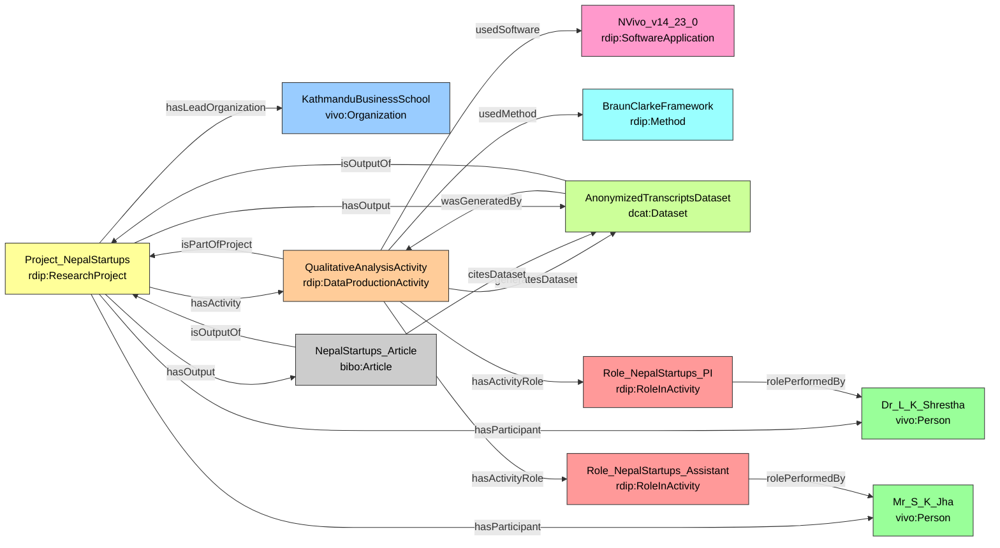

# Case Study 2 — Business / Social Science
## Factors of Startup Failure in Nepal: A Qualitative Study

## Prefixes

```sparql
PREFIX rdip:    <https://w3id.org/rdip/>
PREFIX ex:      <https://w3id.org/rdip/examples/>
PREFIX vivo:    <http://vivoweb.org/ontology/core#>
PREFIX bibo:    <http://purl.org/ontology/bibo/>
PREFIX dcat:    <http://www.w3.org/ns/dcat#>
PREFIX prov:    <http://www.w3.org/ns/prov#>
PREFIX cito:    <http://purl.org/spar/cito/>
PREFIX rdfs:    <http://www.w3.org/2000/01/rdf-schema#>
PREFIX xsd:     <http://www.w3.org/2001/XMLSchema#>
PREFIX dcterms: <http://purl.org/dc/terms/>
```

**Fictional publication:** Shrestha, L. K., & Jha, S. K. (2024). Why Startups Fail in Nepal: A Thematic Analysis of Founder Interviews. *Journal of Entrepreneurship in Emerging Economies*, 16(3), 201–218.

---

### 1. Modeling the Project and Team

```turtle
# Organization
ex:KathmanduBusinessSchool a vivo:Organization ;
    rdfs:label "Kathmandu Business School" .

# Project
ex:Project_NepalStartups a rdip:ResearchProject ;
    rdip:title            "Qualitative study of startup failure in Nepal" ;
    rdip:identifier       "https://raid.org/10.9876/raid.2023.013" ;
    rdip:description      "Business research project conducting qualitative interviews with founders of failed startups in Nepal." ;
    rdip:hasLeadOrganization ex:KathmanduBusinessSchool ;
    rdip:projectStart     "2025-02-01T00:00:00"^^xsd:dateTime ;
    rdip:projectEnd       "2025-11-30T00:00:00"^^xsd:dateTime .

# People
ex:Dr_L_K_Shrestha a vivo:Person ;
    rdfs:label   "Dr. L. K. Shrestha" ;
    rdip:orcidId <https://orcid.org/0000-0002-4444-5555> .

ex:Mr_S_K_Jha a vivo:Person ;
    rdfs:label "Mr. S. K. Jha" .
```

**Key design decisions:**

- A qualitative social-science study is also a `rdip:ResearchProject` — demonstrating the ontology's multidisciplinary scope. The RAiD makes this humanities project as Findable as a computational one (FAIR F).
- The VIVO role pattern distinguishes Principal Investigator from Research Assistant, enabling precise attribution queries.

---

### 2. Modeling Data Production and Provenance

**Key design decisions:**

- "Data production" in a qualitative context means conducting interviews and performing thematic coding — the `rdip:DataProductionActivity` class is broad enough to capture this.
- NVivo is modeled as a `rdip:SoftwareApplication` with a version number for methodological transparency (FAIR R). Another researcher validating the coding process must know which version of NVivo was used.
- The Braun & Clarke framework is a `rdip:Method` — a non-software intellectual framework linked to its defining publication DOI, making the method itself citable and Findable (FAIR F, A).

```turtle
# Software
ex:NVivo_v14_23_0 a rdip:SoftwareApplication ;
    rdip:title      "NVivo" ;
    rdip:version    "14.23.0" ;
    rdip:identifier "https://lumivero.com/products/nvivo/" .

# Method
ex:BraunClarkeFramework a rdip:Method ;
    rdip:title       "Braun and Clarke reflexive thematic analysis" ;
    rdip:description "Six-phase framework for reflexive thematic analysis of qualitative data." .

# Activity
ex:QualitativeAnalysisActivity a rdip:DataProductionActivity ;
    rdip:title               "Qualitative interview transcription and thematic coding" ;
    rdip:activityDescription "Transcribing founder interviews and conducting thematic analysis on startup failure factors using NVivo." ;
    rdip:isPartOfProject     ex:Project_NepalStartups ;
    rdip:usedSoftware        ex:NVivo_v14_23_0 ;
    rdip:usedMethod          ex:BraunClarkeFramework ;
    rdip:generatesDataset    ex:AnonymizedTranscriptsDataset ;
    rdip:activityStart       "2025-03-15T09:00:00"^^xsd:dateTime ;
    rdip:activityEnd         "2025-08-31T17:00:00"^^xsd:dateTime .

# Roles
ex:Role_NepalStartups_PI a rdip:RoleInActivity ;
    rdip:roleLabel       "Principal Investigator" ;
    rdip:rolePerformedBy ex:Dr_L_K_Shrestha .

ex:Role_NepalStartups_Assistant a rdip:RoleInActivity ;
    rdip:roleLabel       "Research Assistant" ;
    rdip:rolePerformedBy ex:Mr_S_K_Jha .

ex:QualitativeAnalysisActivity
    rdip:hasActivityRole ex:Role_NepalStartups_PI ,
                         ex:Role_NepalStartups_Assistant .
```

---

### 3. Modeling Outputs and Connections

**Key design decisions:**

- `accessLevel "restricted-metadata-only"` demonstrates that the RDIP ontology correctly handles human-subject data. The metadata is open and Findable, but the data itself is restricted — a key FAIR requirement (FAIR A).
- `cito:citesAsDataSource` (via `rdip:citesDataset`) formally connects the published findings to the underlying restricted data, creating an auditable evidence trail (FAIR I).

```turtle
# Dataset
ex:AnonymizedTranscriptsDataset a dcat:Dataset ;
    rdip:title       "Anonymized interview transcripts on startup failure in Nepal" ;
    rdip:identifier  "https://doi.org/10.5678/dataverse.33333" ;
    rdip:version     "1.0.0" ;
    rdip:accessLevel "restricted-metadata-only" ;
    rdip:landingPage <https://example.org/nepalstartups/metadata> ;
    prov:wasGeneratedBy ex:QualitativeAnalysisActivity ;
    rdip:isOutputOf  ex:Project_NepalStartups .

# Publication
ex:NepalStartups_Article a bibo:Article ;
    rdip:title      "Why Startups Fail in Nepal: A Thematic Analysis of Founder Interviews" ;
    rdip:identifier "https://doi.org/10.1108/JEEE.2024.13333" ;
    rdip:citesDataset ex:AnonymizedTranscriptsDataset ;
    rdip:isOutputOf ex:Project_NepalStartups .

# Project aggregation
ex:Project_NepalStartups
    rdip:hasActivity    ex:QualitativeAnalysisActivity ;
    rdip:hasOutput      ex:AnonymizedTranscriptsDataset ,
                        ex:NepalStartups_Article ;
    rdip:hasParticipant ex:Dr_L_K_Shrestha ,
                        ex:Mr_S_K_Jha .
```

---

### Competency Question Answers — Case Study 2

#### CQ1: Which software (and version) was used to generate the dataset?

| Dataset | Activity | Software | Version |
|---|---|---|---|
| Anonymized interview transcripts on startup failure in Nepal | Qualitative interview transcription and thematic coding | NVivo | 14.23.0 |

**Traceability path:** `ex:AnonymizedTranscriptsDataset` → `prov:wasGeneratedBy` → `ex:QualitativeAnalysisActivity` → `rdip:usedSoftware` → `ex:NVivo_v14_23_0`

---

#### CQ2: Which formal methods were used in the data production activity?

| Activity | Method | Description |
|---|---|---|
| Qualitative interview transcription and thematic coding | Braun and Clarke reflexive thematic analysis | Six-phase framework for reflexive thematic analysis of qualitative data. |

**Note:** The method is linked to its source publication DOI — making the intellectual framework itself a citable, persistent entity.

---

#### CQ3: For the NepalStartups publication, which project produced it and who was the PI?

| Article | Project | PI Name | ORCID |
|---|---|---|---|
| Why Startups Fail in Nepal... | Qualitative study of startup failure in Nepal | Dr. L. K. Shrestha | https://orcid.org/0000-0002-4444-5555 |

---

#### CQ4: Which datasets were produced by the project and what are their access levels?

| Project | Dataset | Access Level | Landing Page |
|---|---|---|---|
| Qualitative study of startup failure in Nepal | Anonymized interview transcripts... | restricted-metadata-only | https://example.org/nepalstartups/metadata |

> **FAIR note:** `accessLevel "restricted-metadata-only"` correctly signals that the metadata record is open (Findable/Accessible) while the raw interview data is ethically restricted — a critical distinction for human-subject research.

---

#### CQ5: What other outputs were produced by the same project?

Starting from `ex:AnonymizedTranscriptsDataset`:

| Given Output | Project | Co-Output | Type |
|---|---|---|---|
| Anonymized interview transcripts... | NepalStartups | Why Startups Fail in Nepal... | bibo:Article |

---

#### CQ6: What role did each person play in the analysis activity?

| Person | Activity | Project | Role |
|---|---|---|---|
| Dr. L. K. Shrestha | Qualitative interview transcription and thematic coding | NepalStartups | Principal Investigator |
| Mr. S. K. Jha | Qualitative interview transcription and thematic coding | NepalStartups | Research Assistant |

---

#### CQ7: Full provenance chain for the dataset

| Dataset | Activity | Software | Version | Project | Agent | Role |
|---|---|---|---|---|---|---|
| Anonymized interview transcripts... | Qualitative interview transcription and thematic coding | NVivo | 14.23.0 | NepalStartups | Dr. L. K. Shrestha | Principal Investigator |
| Anonymized interview transcripts... | Qualitative interview transcription and thematic coding | NVivo | 14.23.0 | NepalStartups | Mr. S. K. Jha | Research Assistant |

### Diagram

