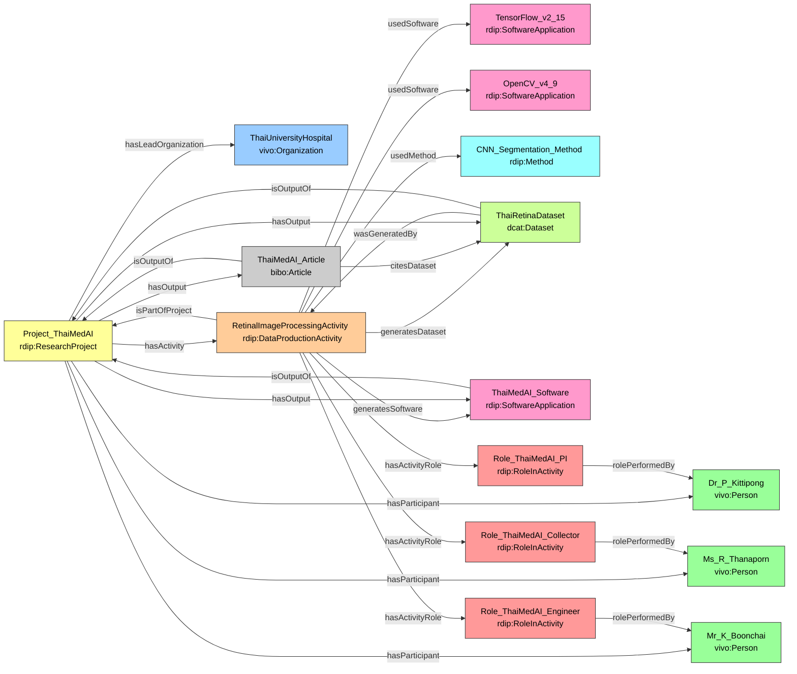

# Case Study 3 — Medical / Clinical AI
## AI-Assisted Screening for Diabetic Retinopathy in Thailand

## Prefixes

```sparql
PREFIX rdip:    <https://w3id.org/rdip/>
PREFIX ex:      <https://w3id.org/rdip/examples/>
PREFIX vivo:    <http://vivoweb.org/ontology/core#>
PREFIX bibo:    <http://purl.org/ontology/bibo/>
PREFIX dcat:    <http://www.w3.org/ns/dcat#>
PREFIX prov:    <http://www.w3.org/ns/prov#>
PREFIX cito:    <http://purl.org/spar/cito/>
PREFIX rdfs:    <http://www.w3.org/2000/01/rdf-schema#>
PREFIX xsd:     <http://www.w3.org/2001/XMLSchema#>
PREFIX dcterms: <http://purl.org/dc/terms/>
```

**Fictional publication:** Doe, P., Smith, R., & Ray, K. (2025). AI-based retinal screening for early diabetic retinopathy in Thailand. *npj Digital Medicine*, 8(1), 112.

---

### 1. Modeling the Project and Team

```turtle
# Organization
ex:ThaiUniversityHospital a vivo:Organization ;
    rdfs:label "Thai University Hospital" .

# Project
ex:Project_ThaiMedAI a rdip:ResearchProject ;
    rdip:title            "AI-assisted screening for diabetic retinopathy in Thailand" ;
    rdip:identifier       "https://raid.org/10.9876/raid.2025.021" ;
    rdip:description      "Medical AI project developing a deep learning system for early detection of diabetic retinopathy from retinal fundus images." ;
    rdip:hasLeadOrganization ex:ThaiUniversityHospital ;
    rdip:projectStart     "2025-03-01T00:00:00"^^xsd:dateTime ;
    rdip:projectEnd       "2026-02-28T00:00:00"^^xsd:dateTime .

# People
ex:Dr_P_Doe a vivo:Person ;
    rdfs:label   "Dr. P. Doe" ;
    rdip:orcidId <https://orcid.org/0000-0001-9999-0004> .

ex:Ms_R_Smith a vivo:Person ;
    rdfs:label   "Ms. R. Smith" ;
    rdip:orcidId <https://orcid.org/0000-0001-9999-0005> .

ex:Mr_K_Ray a vivo:Person ;
    rdfs:label "Mr. K. Ray" .
```

**Key design decisions:**

- Three distinct roles on a single activity (PI, Data Collector, Software Engineer) demonstrate how `rdip:RoleInActivity` supports complex team structures beyond a binary PI/assistant model.
- In a medical context, ORCID iDs on clinical researchers are especially important for accountability and regulatory traceability.

---

### 2. Modeling Data Production and Provenance

**Key design decisions:**

- A single `rdip:DataProductionActivity` captures both image preprocessing (OpenCV) and CNN model training (TensorFlow), with two software tools explicitly listed.
- The activity both `rdip:generatesDataset` (the processed image dataset) and `rdip:generatesSoftware` (the trained model), correctly representing that a medical AI workflow produces both a data artefact and a software artefact.
- The CNN training protocol is a `rdip:Method` — in clinical AI, the training protocol is itself a regulatorily significant artefact subject to audit.

```turtle
# Software
ex:TensorFlow_v2_15 a rdip:SoftwareApplication ;
    rdip:title      "TensorFlow" ;
    rdip:version    "2.15.0" ;
    rdip:identifier "https://www.tensorflow.org/" .

ex:OpenCV_v4_9 a rdip:SoftwareApplication ;
    rdip:title      "OpenCV" ;
    rdip:version    "4.9.0" ;
    rdip:identifier "https://opencv.org/" .

# Trained model output
ex:ThaiMedAI_Software a rdip:SoftwareApplication ;
    rdip:title       "ThaiMedAI retinal screening model" ;
    rdip:version     "1.0.0" ;
    rdip:description "Trained CNN model for automated diabetic retinopathy screening." ;
    rdip:identifier  "https://example.org/thaimedai/software" ;
    rdip:isOutputOf  ex:Project_ThaiMedAI .

# Method
ex:CNN_Segmentation_Method a rdip:Method ;
    rdip:title       "Deep CNN classification protocol for retinal images" ;
    rdip:description "Protocol describing CLAHE preprocessing, EfficientNet-B4 fine-tuning, and 5-class DR grading." .

# Activity
ex:RetinalImageProcessingActivity a rdip:DataProductionActivity ;
    rdip:title               "Retinal image preprocessing and CNN training" ;
    rdip:activityDescription "Preprocessing retinal fundus images with CLAHE and training an EfficientNet-B4 CNN for 5-class diabetic retinopathy grading." ;
    rdip:isPartOfProject     ex:Project_ThaiMedAI ;
    rdip:usedSoftware        ex:TensorFlow_v2_15 , ex:OpenCV_v4_9 ;
    rdip:usedMethod          ex:CNN_Segmentation_Method ;
    rdip:generatesDataset    ex:ThaiRetinaDataset ;
    rdip:generatesSoftware   ex:ThaiMedAI_Software ;
    rdip:activityStart       "2025-05-01T09:00:00"^^xsd:dateTime ;
    rdip:activityEnd         "2025-10-31T17:00:00"^^xsd:dateTime .

# Roles
ex:Role_ThaiMedAI_PI a rdip:RoleInActivity ;
    rdip:roleLabel       "Principal Investigator" ;
    rdip:rolePerformedBy ex:Dr_P_Doe .

ex:Role_ThaiMedAI_Collector a rdip:RoleInActivity ;
    rdip:roleLabel       "Data Collector" ;
    rdip:rolePerformedBy ex:Ms_R_Smith .

ex:Role_ThaiMedAI_Engineer a rdip:RoleInActivity ;
    rdip:roleLabel       "Software Engineer" ;
    rdip:rolePerformedBy ex:Mr_K_Ray .

ex:RetinalImageProcessingActivity
    rdip:hasActivityRole ex:Role_ThaiMedAI_PI ,
                         ex:Role_ThaiMedAI_Collector ,
                         ex:Role_ThaiMedAI_Engineer .
```

---

### 3. Modeling Outputs and Connections

**Key design decisions:**

- `accessLevel "restricted-controlled-access"` reflects the IRB/ethics board constraints on clinical retinal image data. The landing page is accessible; the data itself requires a formal data access agreement (FAIR A1.2).
- The publication cites the dataset via `rdip:citesDataset`, creating a traceable evidence chain from the published clinical findings back to the specific controlled-access data cohort used — critical for clinical reproducibility audits.
- Three outputs from one project (dataset, trained model software, article) demonstrate how `rdip:hasOutput` aggregates heterogeneous research artefacts.

```turtle
# Dataset
ex:ThaiRetinaDataset a dcat:Dataset ;
    rdip:title       "Anonymized retinal fundus image dataset from Thai screening program" ;
    rdip:identifier  "https://doi.org/10.4444/thaimedai.dataset" ;
    rdip:version     "1.0.0" ;
    rdip:accessLevel "restricted-controlled-access" ;
    rdip:landingPage <https://example.org/thaimedai/dataset> ;
    prov:wasGeneratedBy ex:RetinalImageProcessingActivity ;
    rdip:isOutputOf  ex:Project_ThaiMedAI .

# Publication
ex:ThaiMedAI_Article a bibo:Article ;
    rdip:title        "AI-based retinal screening for early diabetic retinopathy in Thailand" ;
    rdip:identifier   "https://doi.org/10.1038/s41746-025-00112-0" ;
    rdip:description  "Clinical evaluation of an AI-assisted retinal screening system for diabetic retinopathy." ;
    rdip:citesDataset ex:ThaiRetinaDataset ;
    rdip:isOutputOf   ex:Project_ThaiMedAI .

# Project aggregation
ex:Project_ThaiMedAI
    rdip:hasActivity    ex:RetinalImageProcessingActivity ;
    rdip:hasOutput      ex:ThaiRetinaDataset ,
                        ex:ThaiMedAI_Software ,
                        ex:ThaiMedAI_Article ;
    rdip:hasParticipant ex:Dr_P_Doe ,
                        ex:Ms_R_Smith ,
                        ex:Mr_K_Ray .
```

---

### Competency Question Answers — Case Study 3

#### CQ1: Which software (and version) was used to generate the dataset?

| Dataset | Activity | Software | Version |
|---|---|---|---|
| Anonymized retinal fundus image dataset... | Retinal image preprocessing and CNN training | TensorFlow | 2.15.0 |
| Anonymized retinal fundus image dataset... | Retinal image preprocessing and CNN training | OpenCV | 4.9.0 |

**Traceability path:** `ex:ThaiRetinaDataset` → `prov:wasGeneratedBy` → `ex:RetinalImageProcessingActivity` → `rdip:usedSoftware` → `ex:TensorFlow_v2_15` / `ex:OpenCV_v4_9`

---

#### CQ2: Which formal methods were used in the data production activity?

| Activity | Method | Description |
|---|---|---|
| Retinal image preprocessing and CNN training | Deep CNN classification protocol for retinal images | Protocol describing CLAHE preprocessing, EfficientNet-B4 fine-tuning, and 5-class DR grading. |

---

#### CQ3: For the ThaiMedAI publication, which project produced it and who was the PI?

| Article | Project | PI Name | ORCID |
|---|---|---|---|
| AI-based retinal screening for early diabetic retinopathy in Thailand | AI-assisted screening for diabetic retinopathy in Thailand | Dr. P. Doe | https://orcid.org/0000-0001-9999-0004 |

---

#### CQ4: Which datasets were produced by the project and what are their access levels?

| Project | Dataset | Access Level | Landing Page |
|---|---|---|---|
| AI-assisted screening for diabetic retinopathy in Thailand | Anonymized retinal fundus image dataset... | restricted-controlled-access | https://example.org/thaimedai/dataset |

> **Clinical note:** `restricted-controlled-access` indicates a formal data access agreement is required (e.g. IRB approval). The landing page remains publicly accessible for discoverability (FAIR F, A1.2).

---

#### CQ5: What other outputs were produced by the same project?

Starting from `ex:ThaiRetinaDataset`:

| Given Output | Project | Co-Output | Type |
|---|---|---|---|
| Anonymized retinal fundus image dataset | ThaiMedAI | ThaiMedAI retinal screening model | rdip:SoftwareApplication |
| Anonymized retinal fundus image dataset | ThaiMedAI | AI-based retinal screening... article | bibo:Article |

> ThaiMedAI is the only project in these case studies that produces three distinct output types (dataset, software, publication) — demonstrating the ontology's ability to aggregate heterogeneous artefacts under one project node.

---

#### CQ6: What role did each person play in the activity?

| Person | Activity | Project | Role |
|---|---|---|---|
| Dr. P. Doe | Retinal image preprocessing and CNN training | ThaiMedAI | Principal Investigator |
| Ms. R. Smith | Retinal image preprocessing and CNN training | ThaiMedAI | Data Collector |
| Mr. K. Ray | Retinal image preprocessing and CNN training | ThaiMedAI | Software Engineer |

---

#### CQ7: Full provenance chain for the dataset

| Dataset | Activity | Software | Version | Project | Agent | Role |
|---|---|---|---|---|---|---|
| Anonymized retinal fundus image dataset | Retinal image preprocessing and CNN training | TensorFlow | 2.15.0 | ThaiMedAI | Dr. P. Doe | Principal Investigator |
| Anonymized retinal fundus image dataset | Retinal image preprocessing and CNN training | TensorFlow | 2.15.0 | ThaiMedAI | Ms. R. Smith | Data Collector |
| Anonymized retinal fundus image dataset | Retinal image preprocessing and CNN training | TensorFlow | 2.15.0 | ThaiMedAI | Mr. K. Ray | Software Engineer |
| Anonymized retinal fundus image dataset | Retinal image preprocessing and CNN training | OpenCV | 4.9.0 | ThaiMedAI | Dr. P. Doe | Principal Investigator |
| Anonymized retinal fundus image dataset | Retinal image preprocessing and CNN training | OpenCV | 4.9.0 | ThaiMedAI | Ms. R. Smith | Data Collector |
| Anonymized retinal fundus image dataset | Retinal image preprocessing and CNN training | OpenCV | 4.9.0 | ThaiMedAI | Mr. K. Ray | Software Engineer |

> 6 rows = 2 software tools × 3 agents. All rows are correct and expected.

### Diagram

