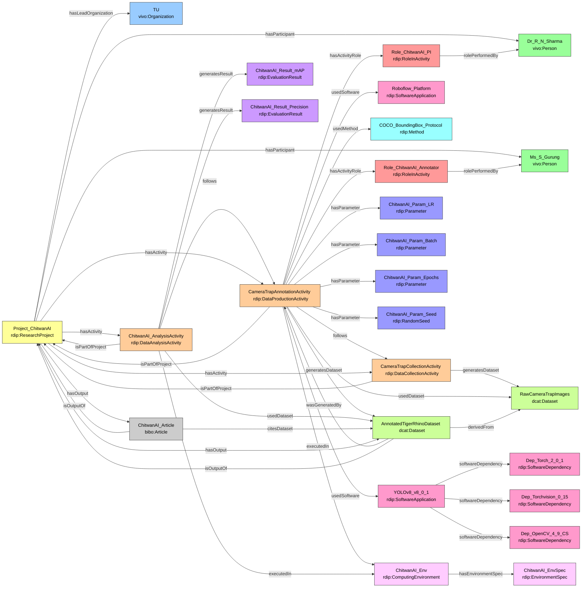

# Case Study 1 — Computer Science
## Automated Wildlife Monitoring in Chitwan National Park using YOLOv8

---

## Prefixes

```sparql
PREFIX rdip:    <https://w3id.org/rdip/>
PREFIX ex:      <https://w3id.org/rdip/examples/>
PREFIX vivo:    <http://vivoweb.org/ontology/core#>
PREFIX bibo:    <http://purl.org/ontology/bibo/>
PREFIX dcat:    <http://www.w3.org/ns/dcat#>
PREFIX prov:    <http://www.w3.org/ns/prov#>
PREFIX cito:    <http://purl.org/spar/cito/>
PREFIX rdfs:    <http://www.w3.org/2000/01/rdf-schema#>
PREFIX xsd:     <http://www.w3.org/2001/XMLSchema#>
PREFIX dcterms: <http://purl.org/dc/terms/>
```

---

---

**Fictional publication:** Sharma, R., & Gurung, S. (2024). A YOLOv8-based System for Real-time Tiger and Rhino Detection from Camera Traps. *IEEE Transactions on Pattern Analysis and Machine Intelligence*, 46(11), 1234–1245.

---

### 1. Project, Team and Organization

```turtle
ex:TU a vivo:Organization ;
    rdfs:label   "Tribhuvan University" ;
    rdip:rorId   <https://ror.org/02rg1r889> .

ex:Project_ChitwanAI a rdip:ResearchProject ;
    rdip:title             "ChitwanAI: Camera-trap wildlife detection in Nepal" ;
    rdip:identifier        "https://raid.org/10.9876/raid.2023.011" ;
    rdip:description       "Deep learning project using camera-trap images from Chitwan National Park to detect tigers and rhinos." ;
    rdip:hasLeadOrganization ex:TU ;
    rdip:projectStart      "2025-01-01T00:00:00"^^xsd:dateTime ;
    rdip:projectEnd        "2025-12-31T00:00:00"^^xsd:dateTime ;
    rdip:fundingReference  "TU-SRF-2025-CS-001" .

ex:Dr_R_N_Sharma a vivo:Person ;
    rdfs:label   "Dr. R. N. Sharma" ;
    rdip:orcidId <https://orcid.org/0000-0002-1234-5678> .

ex:Ms_S_Gurung a vivo:Person ;
    rdfs:label "Ms. S. Gurung" .
```

---

### 2. Software, Dependencies and Computing Environment *(new)*

```turtle
# YOLOv8 with pinned library dependencies
ex:YOLOv8_v8_0_1 a rdip:SoftwareApplication ;
    rdip:title           "Ultralytics YOLOv8" ;
    rdip:version         "8.0.1" ;
    rdip:identifier      "https://github.com/ultralytics/ultralytics" ;
    rdip:repositoryUrl   <https://github.com/ultralytics/ultralytics> ;
    rdip:softwareLicense <https://opensource.org/licenses/AGPL-3.0> ;
    rdip:softwareDependency
        ex:Dep_Torch_2_0_1 ,
        ex:Dep_Torchvision_0_15 ,
        ex:Dep_OpenCV_4_9_CS .

ex:Dep_Torch_2_0_1 a rdip:SoftwareDependency ;
    rdip:dependencyName    "torch" ;
    rdip:dependencyVersion "2.0.1" ;
    rdip:dependencyType    "runtime" .

ex:Dep_Torchvision_0_15 a rdip:SoftwareDependency ;
    rdip:dependencyName    "torchvision" ;
    rdip:dependencyVersion "0.15.2" ;
    rdip:dependencyType    "runtime" .

ex:Dep_OpenCV_4_9_CS a rdip:SoftwareDependency ;
    rdip:dependencyName    "opencv-python" ;
    rdip:dependencyVersion "4.9.0.80" ;
    rdip:dependencyType    "runtime" .

ex:Roboflow_Platform a rdip:SoftwareApplication ;
    rdip:title   "Roboflow" ;
    rdip:version "web-2025-01" ;
    rdip:identifier "https://roboflow.com/" .

# Computing environment
ex:ChitwanAI_Env a rdip:ComputingEnvironment ;
    rdip:osVersion    "Ubuntu 22.04.3 LTS" ;
    rdip:gpuModel     "NVIDIA RTX 3090 24GB" ;
    rdip:cudaVersion  "12.1" ;
    rdip:cpuCores     16 ;
    rdip:ramGB        64.0 ;
    rdip:hardwareSpec "Intel Core i9-13900K, NVIDIA RTX 3090 24GB VRAM, 64 GB DDR5" ;
    rdip:hasEnvironmentSpec ex:ChitwanAI_EnvSpec .

ex:ChitwanAI_EnvSpec a rdip:EnvironmentSpec ;
    rdip:specType "pip-requirements" ;
    rdip:specUri  <https://github.com/example/chitwanai/blob/main/requirements.txt> .
```

---

### 3. Method

```turtle
ex:COCO_BoundingBox_Protocol a rdip:Method ;
    rdip:title           "COCO-style bounding box annotation protocol" ;
    rdip:description     "Object detection annotation using COCO conventions for class labels and bounding boxes." ;
    rdip:methodDoi       <https://doi.org/10.1007/978-3-319-10602-1_48> .
```

---

### 4. Hyperparameters and Random Seed *(v2)*

```turtle
ex:ChitwanAI_Param_LR a rdip:Parameter ;
    rdip:parameterName     "learning_rate" ;
    rdip:parameterValue    "0.01" ;
    rdip:parameterDataType "xsd:float" .

ex:ChitwanAI_Param_Batch a rdip:Parameter ;
    rdip:parameterName     "batch_size" ;
    rdip:parameterValue    "16" ;
    rdip:parameterDataType "xsd:integer" .

ex:ChitwanAI_Param_Epochs a rdip:Parameter ;
    rdip:parameterName     "num_epochs" ;
    rdip:parameterValue    "100" ;
    rdip:parameterDataType "xsd:integer" .

# Explicitly typed RandomSeed subclass for stochastic reproducibility
ex:ChitwanAI_Param_Seed a rdip:RandomSeed ;
    rdip:parameterName     "random_seed" ;
    rdip:parameterValue    "42" ;
    rdip:parameterDataType "xsd:integer" .
```

---

### 5. Activities with Sequencing *(v2)*

**v2 splits the single v1 activity into three correctly typed activities**, connected by `rdip:follows` to express the execution order.

```turtle
# Activity 1 — Data collection
ex:CameraTrapCollectionActivity a rdip:DataCollectionActivity ;
    rdip:title               "Raw camera-trap image collection" ;
    rdip:activityDescription "Deploying and retrieving camera traps in Chitwan National Park. Images stored as JPEG." ;
    rdip:isPartOfProject     ex:Project_ChitwanAI ;
    rdip:generatesDataset    ex:RawCameraTrapImages ;
    rdip:activityStart       "2025-01-15T06:00:00"^^xsd:dateTime ;
    rdip:activityEnd         "2025-03-31T18:00:00"^^xsd:dateTime .

# Activity 2 — Data production (annotation + training)
ex:CameraTrapAnnotationActivity a rdip:DataProductionActivity ;
    rdip:title               "Camera-trap image annotation and YOLOv8 training" ;
    rdip:activityDescription "Annotating tiger and rhino images with COCO bounding boxes via Roboflow, then training YOLOv8 on the annotated dataset." ;
    rdip:isPartOfProject     ex:Project_ChitwanAI ;
    rdip:usedDataset         ex:RawCameraTrapImages ;
    rdip:usedSoftware        ex:YOLOv8_v8_0_1 , ex:Roboflow_Platform ;
    rdip:usedMethod          ex:COCO_BoundingBox_Protocol ;
    rdip:generatesDataset    ex:AnnotatedTigerRhinoDataset ;
    rdip:executedIn          ex:ChitwanAI_Env ;
    rdip:hasParameter        ex:ChitwanAI_Param_LR ,
                             ex:ChitwanAI_Param_Batch ,
                             ex:ChitwanAI_Param_Epochs ,
                             ex:ChitwanAI_Param_Seed ;
    rdip:follows             ex:CameraTrapCollectionActivity ;
    rdip:activityStart       "2025-04-01T09:00:00"^^xsd:dateTime ;
    rdip:activityEnd         "2025-06-30T17:00:00"^^xsd:dateTime .

# Activity 3 — Model evaluation
ex:ChitwanAI_AnalysisActivity a rdip:DataAnalysisActivity ;
    rdip:title               "YOLOv8 model evaluation on test split" ;
    rdip:activityDescription "Evaluating trained YOLOv8 on held-out test images; recording mAP@0.5 and precision." ;
    rdip:isPartOfProject     ex:Project_ChitwanAI ;
    rdip:usedDataset         ex:AnnotatedTigerRhinoDataset ;
    rdip:generatesResult     ex:ChitwanAI_Result_mAP , ex:ChitwanAI_Result_Precision ;
    rdip:executedIn          ex:ChitwanAI_Env ;
    rdip:follows             ex:CameraTrapAnnotationActivity ;
    rdip:activityStart       "2025-07-01T09:00:00"^^xsd:dateTime ;
    rdip:activityEnd         "2025-08-20T17:00:00"^^xsd:dateTime .

# Roles on production activity
ex:Role_ChitwanAI_PI a rdip:RoleInActivity ;
    rdip:roleLabel       "Principal Investigator" ;
    rdip:rolePerformedBy ex:Dr_R_N_Sharma .

ex:Role_ChitwanAI_Annotator a rdip:RoleInActivity ;
    rdip:roleLabel       "Data Annotator" ;
    rdip:rolePerformedBy ex:Ms_S_Gurung .

ex:CameraTrapAnnotationActivity
    rdip:hasActivityRole ex:Role_ChitwanAI_PI ,
                         ex:Role_ChitwanAI_Annotator .
```

---

### 6. Datasets with Derivation Chain *(new)*

```turtle
ex:RawCameraTrapImages a dcat:Dataset ;
    rdip:title       "Raw camera-trap images from Chitwan National Park" ;
    rdip:identifier  "doi:10.1111/chitwanai.raw" ;
    rdip:accessLevel "open" ;
    rdip:dataLicense <https://creativecommons.org/licenses/by/4.0/> ;
    rdip:dataFormat  "JPEG" .

ex:AnnotatedTigerRhinoDataset a dcat:Dataset ;
    rdip:title        "Annotated tiger and rhino bounding boxes" ;
    rdip:identifier   "https://doi.org/10.5678/zenodo.11111" ;
    rdip:version      "1.0.0" ;
    rdip:accessLevel  "open" ;
    rdip:dataLicense  <https://creativecommons.org/licenses/by/4.0/> ;
    rdip:dataFormat   "COCO JSON" ;
    rdip:landingPage  <https://example.org/chitwanai/dataset> ;
    rdip:checksum     "sha256:a3f9b2c44e8d102938475b12090f3cd8" ;
    prov:wasGeneratedBy ex:CameraTrapAnnotationActivity ;
    rdip:isOutputOf   ex:Project_ChitwanAI ;
    rdip:derivedFrom  ex:RawCameraTrapImages .   # closes the PROV-O wasDerivedFrom chain
```

---

### 7. Evaluation Results *(new)*

```turtle
ex:ChitwanAI_Result_mAP a rdip:EvaluationResult ;
    rdip:metricName     "mAP@0.5" ;
    rdip:metricValue    "0.873" ;
    rdip:metricDataType "xsd:float" ;
    rdip:splitLabel     "test" ;
    rdip:evaluationDate "2025-08-15T00:00:00"^^xsd:dateTime .

ex:ChitwanAI_Result_Precision a rdip:EvaluationResult ;
    rdip:metricName     "precision" ;
    rdip:metricValue    "0.891" ;
    rdip:metricDataType "xsd:float" ;
    rdip:splitLabel     "test" .
```

---

### 8. Publication and Project Aggregation

```turtle
ex:ChitwanAI_Article a bibo:Article ;
    rdip:title        "A YOLOv8-based System for Real-time Tiger and Rhino Detection from Camera Traps" ;
    rdip:identifier   "https://doi.org/10.1109/TPAMI.2024.11111" ;
    rdip:citesDataset ex:AnnotatedTigerRhinoDataset ;
    rdip:isOutputOf   ex:Project_ChitwanAI .

ex:Project_ChitwanAI
    rdip:hasActivity    ex:CameraTrapCollectionActivity ,
                        ex:CameraTrapAnnotationActivity ,
                        ex:ChitwanAI_AnalysisActivity ;
    rdip:hasOutput      ex:AnnotatedTigerRhinoDataset ,
                        ex:ChitwanAI_Article ;
    rdip:hasParticipant ex:Dr_R_N_Sharma ,
                        ex:Ms_S_Gurung .
```

---

### Competency Question Answers — Case Study 1 (v2)

#### CQ1 — Software used to generate dataset

| Dataset | Software | Version |
|---|---|---|
| Annotated tiger and rhino bounding boxes | Ultralytics YOLOv8 | 8.0.1 |
| Annotated tiger and rhino bounding boxes | Roboflow | web-2025-01 |

#### CQ2 — Methods used in activity

| Activity | Method | DOI |
|---|---|---|
| Camera-trap image annotation and YOLOv8 training | COCO-style bounding box annotation protocol | https://doi.org/10.1007/978-3-319-10602-1_48 |

#### CQ3 — Publication → Project → PI

| Article | Project | PI | ORCID |
|---|---|---|---|
| A YOLOv8-based System... | ChitwanAI | Dr. R. N. Sharma | 0000-0002-1234-5678 |

#### CQ4 — Project datasets, access levels, landing pages

| Dataset | Access | Landing Page | License |
|---|---|---|---|
| Annotated tiger and rhino bounding boxes | open | https://example.org/chitwanai/dataset | CC-BY 4.0 |

#### CQ5 — Co-outputs of same project

| Given Output | Co-Output | Type |
|---|---|---|
| Annotated tiger and rhino bounding boxes | A YOLOv8-based System... | bibo:Article |

#### CQ6 — Person roles in activities

| Person | Activity | Role |
|---|---|---|
| Dr. R. N. Sharma | Camera-trap image annotation and YOLOv8 training | Principal Investigator |
| Ms. S. Gurung | Camera-trap image annotation and YOLOv8 training | Data Annotator |

#### CQ7 — Full provenance chain

| Dataset | Activity | Software | Version | Project | Agent | Role |
|---|---|---|---|---|---|---|
| Annotated bounding boxes | Annotation & training | YOLOv8 | 8.0.1 | ChitwanAI | Dr. R. N. Sharma | PI |
| Annotated bounding boxes | Annotation & training | YOLOv8 | 8.0.1 | ChitwanAI | Ms. S. Gurung | Annotator |
| Annotated bounding boxes | Annotation & training | Roboflow | web-2025-01 | ChitwanAI | Dr. R. N. Sharma | PI |
| Annotated bounding boxes | Annotation & training | Roboflow | web-2025-01 | ChitwanAI | Ms. S. Gurung | Annotator |

#### CQ8 — Hyperparameters and random seed *(new)*

| Activity | Parameter | Value | Type | Is Random Seed? |
|---|---|---|---|---|
| Camera-trap image annotation and YOLOv8 training | random_seed | 42 | xsd:integer | Yes |
| Camera-trap image annotation and YOLOv8 training | num_epochs | 100 | xsd:integer | No |
| Camera-trap image annotation and YOLOv8 training | learning_rate | 0.01 | xsd:float | No |
| Camera-trap image annotation and YOLOv8 training | batch_size | 16 | xsd:integer | No |

#### CQ9 — Computing environment *(new)*

| Activity | OS | GPU | CUDA | RAM | Spec Type | Spec URI |
|---|---|---|---|---|---|---|
| Camera-trap image annotation and YOLOv8 training | Ubuntu 22.04.3 LTS | NVIDIA RTX 3090 24GB | 12.1 | 64 GB | pip-requirements | github.com/…/requirements.txt |
| YOLOv8 model evaluation on test split | Ubuntu 22.04.3 LTS | NVIDIA RTX 3090 24GB | 12.1 | 64 GB | pip-requirements | github.com/…/requirements.txt |

#### CQ10 — Evaluation results *(new)*

| Project | Metric | Value | Split | Date |
|---|---|---|---|---|
| ChitwanAI | mAP@0.5 | 0.873 | test | 2025-08-15 |
| ChitwanAI | precision | 0.891 | test | — |

#### CQ11 — Dataset lineage *(new)*

| Derived Dataset | Source Dataset | Activity | Activity Type |
|---|---|---|---|
| Annotated tiger and rhino bounding boxes | Raw camera-trap images from Chitwan National Park | Camera-trap image annotation and YOLOv8 training | rdip:DataProductionActivity |

### Diagram

