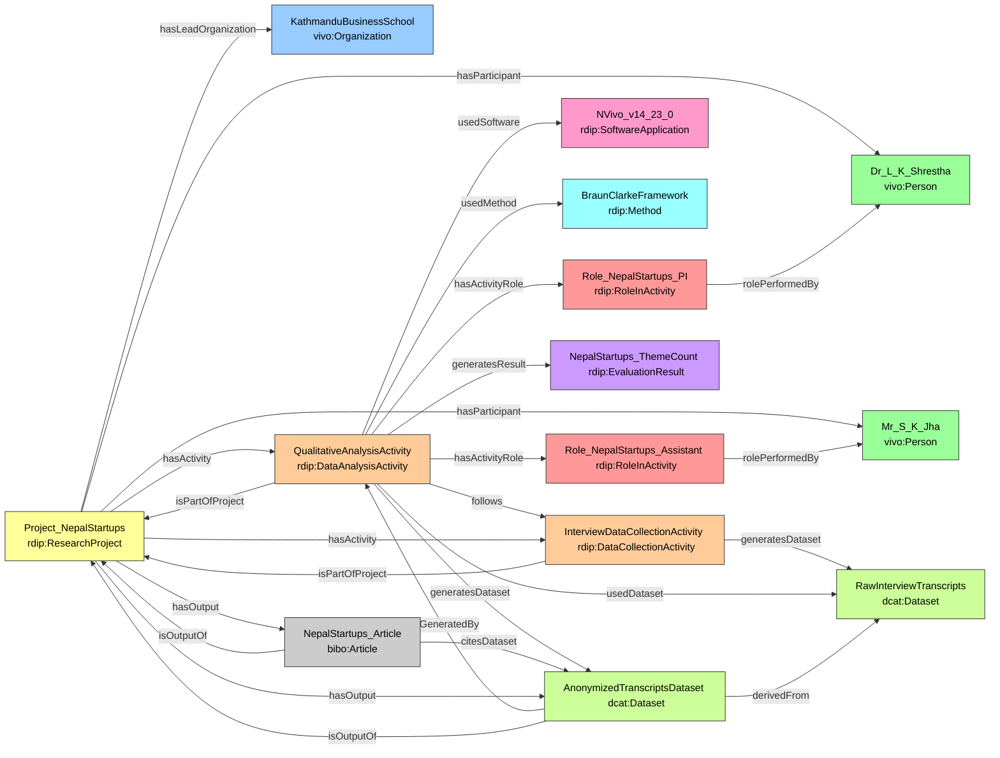

# Case Study 2 — Business / Social Science
## Factors of Startup Failure in Nepal: A Qualitative Study

## Prefixes

```sparql
PREFIX rdip:    <https://w3id.org/rdip/>
PREFIX ex:      <https://w3id.org/rdip/examples/>
PREFIX vivo:    <http://vivoweb.org/ontology/core#>
PREFIX bibo:    <http://purl.org/ontology/bibo/>
PREFIX dcat:    <http://www.w3.org/ns/dcat#>
PREFIX prov:    <http://www.w3.org/ns/prov#>
PREFIX cito:    <http://purl.org/spar/cito/>
PREFIX rdfs:    <http://www.w3.org/2000/01/rdf-schema#>
PREFIX xsd:     <http://www.w3.org/2001/XMLSchema#>
PREFIX dcterms: <http://purl.org/dc/terms/>
```

---

---

**Fictional publication:** Shrestha, L. K., & Jha, S. K. (2024). Why Startups Fail in Nepal: A Thematic Analysis of Founder Interviews. *Journal of Entrepreneurship in Emerging Economies*, 16(3), 201–218.

---

### 1. Project, Team and Organization

```turtle
ex:KathmanduBusinessSchool a vivo:Organization ;
    rdfs:label "Kathmandu Business School" .

ex:Project_NepalStartups a rdip:ResearchProject ;
    rdip:title             "Qualitative study of startup failure in Nepal" ;
    rdip:identifier        "https://raid.org/10.9876/raid.2023.013" ;
    rdip:description       "Business research project conducting qualitative interviews with founders of failed startups in Nepal." ;
    rdip:hasLeadOrganization ex:KathmanduBusinessSchool ;
    rdip:projectStart      "2025-02-01T00:00:00"^^xsd:dateTime ;
    rdip:projectEnd        "2025-11-30T00:00:00"^^xsd:dateTime ;
    rdip:fundingReference  "KBS-RES-2025-B-007" .

ex:Dr_L_K_Shrestha a vivo:Person ;
    rdfs:label   "Dr. L. K. Shrestha" ;
    rdip:orcidId <https://orcid.org/0000-0002-4444-5555> .

ex:Mr_S_K_Jha a vivo:Person ;
    rdfs:label "Mr. S. K. Jha" .
```

---

### 2. Software

```turtle
ex:NVivo_v14_23_0 a rdip:SoftwareApplication ;
    rdip:title      "NVivo" ;
    rdip:version    "14.23.0" ;
    rdip:identifier "https://lumivero.com/products/nvivo/" .
# NVivo is proprietary; no open-source dependency graph.
```

---

### 3. Method

```turtle
ex:BraunClarkeFramework a rdip:Method ;
    rdip:title       "Braun and Clarke reflexive thematic analysis" ;
    rdip:description "Six-phase framework for reflexive thematic analysis of qualitative data." ;
    rdip:methodDoi   <https://doi.org/10.1080/17439760.2016.1262613> .
```

---

### 4. Activities with Correct Types and Sequencing *(v2 refinement)*

**Key v2 change:** The single v1 `rdip:DataProductionActivity` is split into a `rdip:DataCollectionActivity` (interviews) and a `rdip:DataAnalysisActivity` (thematic coding). This is semantically correct — coding is analysis, not production.

```turtle
# Activity 1 — Data collection (interviews)
ex:InterviewDataCollectionActivity a rdip:DataCollectionActivity ;
    rdip:title               "Semi-structured founder interviews" ;
    rdip:activityDescription "Conducting 20 semi-structured interviews with founders of failed Nepali startups. Audio recorded and transcribed verbatim." ;
    rdip:isPartOfProject     ex:Project_NepalStartups ;
    rdip:generatesDataset    ex:RawInterviewTranscripts ;
    rdip:activityStart       "2025-02-15T09:00:00"^^xsd:dateTime ;
    rdip:activityEnd         "2025-05-31T17:00:00"^^xsd:dateTime .

# Activity 2 — Thematic analysis (correctly typed as DataAnalysisActivity)
ex:QualitativeAnalysisActivity a rdip:DataAnalysisActivity ;
    rdip:title               "Qualitative thematic coding and analysis" ;
    rdip:activityDescription "Transcribing founder interviews and conducting reflexive thematic analysis on startup failure factors using NVivo 14." ;
    rdip:isPartOfProject     ex:Project_NepalStartups ;
    rdip:usedDataset         ex:RawInterviewTranscripts ;
    rdip:usedSoftware        ex:NVivo_v14_23_0 ;
    rdip:usedMethod          ex:BraunClarkeFramework ;
    rdip:generatesDataset    ex:AnonymizedTranscriptsDataset ;
    rdip:generatesResult     ex:NepalStartups_ThemeCount ;
    rdip:follows             ex:InterviewDataCollectionActivity ;
    rdip:activityStart       "2025-06-01T09:00:00"^^xsd:dateTime ;
    rdip:activityEnd         "2025-08-31T17:00:00"^^xsd:dateTime .

# Roles
ex:Role_NepalStartups_PI a rdip:RoleInActivity ;
    rdip:roleLabel       "Principal Investigator" ;
    rdip:rolePerformedBy ex:Dr_L_K_Shrestha .

ex:Role_NepalStartups_Assistant a rdip:RoleInActivity ;
    rdip:roleLabel       "Research Assistant" ;
    rdip:rolePerformedBy ex:Mr_S_K_Jha .

ex:QualitativeAnalysisActivity
    rdip:hasActivityRole ex:Role_NepalStartups_PI ,
                         ex:Role_NepalStartups_Assistant .
```

---

### 5. Datasets with Derivation Chain *(new)*

```turtle
ex:RawInterviewTranscripts a dcat:Dataset ;
    rdip:title       "Raw interview transcripts (identifiable)" ;
    rdip:accessLevel "closed" ;
    rdip:dataFormat  "DOCX" ;
    rdip:dataLicense <https://creativecommons.org/licenses/by-nc/4.0/> .

ex:AnonymizedTranscriptsDataset a dcat:Dataset ;
    rdip:title        "Anonymized interview transcripts on startup failure in Nepal" ;
    rdip:identifier   "https://doi.org/10.5678/dataverse.33333" ;
    rdip:version      "1.0.0" ;
    rdip:accessLevel  "restricted-metadata-only" ;
    rdip:dataLicense  <https://creativecommons.org/licenses/by-nc/4.0/> ;
    rdip:dataFormat   "PDF/DOCX" ;
    rdip:landingPage  <https://example.org/nepalstartups/metadata> ;
    prov:wasGeneratedBy ex:QualitativeAnalysisActivity ;
    rdip:isOutputOf   ex:Project_NepalStartups ;
    rdip:derivedFrom  ex:RawInterviewTranscripts .   # derivation: raw → anonymized
```

---

### 6. Evaluation Result *(new)*

For qualitative research the "evaluation result" is the analytic outcome — the number of identified themes.

```turtle
ex:NepalStartups_ThemeCount a rdip:EvaluationResult ;
    rdip:metricName     "identified_themes" ;
    rdip:metricValue    "6" ;
    rdip:metricDataType "xsd:integer" ;
    rdip:splitLabel     "full-corpus" .
```

---

### 7. Publication and Project Aggregation

```turtle
ex:NepalStartups_Article a bibo:Article ;
    rdip:title        "Why Startups Fail in Nepal: A Thematic Analysis of Founder Interviews" ;
    rdip:identifier   "https://doi.org/10.1108/JEEE.2024.13333" ;
    rdip:citesDataset ex:AnonymizedTranscriptsDataset ;
    rdip:isOutputOf   ex:Project_NepalStartups .

ex:Project_NepalStartups
    rdip:hasActivity    ex:InterviewDataCollectionActivity ,
                        ex:QualitativeAnalysisActivity ;
    rdip:hasOutput      ex:AnonymizedTranscriptsDataset ,
                        ex:NepalStartups_Article ;
    rdip:hasParticipant ex:Dr_L_K_Shrestha ,
                        ex:Mr_S_K_Jha .
```

---

### Competency Question Answers — Case Study 2 (v2)

#### CQ1 — Software used to generate dataset

| Dataset | Software | Version |
|---|---|---|
| Anonymized interview transcripts... | NVivo | 14.23.0 |

#### CQ2 — Methods used in activity

| Activity | Method | DOI |
|---|---|---|
| Qualitative thematic coding and analysis | Braun and Clarke reflexive thematic analysis | https://doi.org/10.1080/17439760.2016.1262613 |

#### CQ3 — Publication → Project → PI

| Article | Project | PI | ORCID |
|---|---|---|---|
| Why Startups Fail in Nepal... | Qualitative study of startup failure in Nepal | Dr. L. K. Shrestha | 0000-0002-4444-5555 |

#### CQ4 — Project datasets, access levels, landing pages

| Dataset | Access | Landing Page | License |
|---|---|---|---|
| Anonymized interview transcripts... | restricted-metadata-only | https://example.org/nepalstartups/metadata | CC-BY-NC 4.0 |

#### CQ5 — Co-outputs of same project

| Given Output | Co-Output | Type |
|---|---|---|
| Anonymized interview transcripts... | Why Startups Fail in Nepal... | bibo:Article |

#### CQ6 — Person roles in activities

| Person | Activity | Role |
|---|---|---|
| Dr. L. K. Shrestha | Qualitative thematic coding and analysis | Principal Investigator |
| Mr. S. K. Jha | Qualitative thematic coding and analysis | Research Assistant |

#### CQ7 — Full provenance chain

| Dataset | Activity | Software | Version | Project | Agent | Role |
|---|---|---|---|---|---|---|
| Anonymized transcripts | Qualitative thematic coding | NVivo | 14.23.0 | NepalStartups | Dr. L. K. Shrestha | PI |
| Anonymized transcripts | Qualitative thematic coding | NVivo | 14.23.0 | NepalStartups | Mr. S. K. Jha | Research Assistant |

#### CQ8 — Hyperparameters and random seed *(new)*

> NVivo qualitative coding has no computational hyperparameters or random seeds. This CQ returns **no rows** for the business case study — which is correct and expected. The ontology gracefully handles non-computational research.

| Activity | Parameter | Value | Is Random Seed? |
|---|---|---|---|
| — | — | — | — |

#### CQ9 — Computing environment *(new)*

> NVivo runs on a standard laptop; no GPU or CUDA environment is required. No `rdip:ComputingEnvironment` is asserted. CQ9 returns **no rows** — correct and expected.

| Activity | OS | GPU | CUDA |
|---|---|---|---|
| — | — | — | — |

#### CQ10 — Evaluation results *(new)*

| Project | Metric | Value | Split |
|---|---|---|---|
| NepalStartups | identified_themes | 6 | full-corpus |

#### CQ11 — Dataset lineage *(new)*

| Derived Dataset | Source Dataset | Activity | Activity Type |
|---|---|---|---|
| Anonymized interview transcripts... | Raw interview transcripts (identifiable) | Qualitative thematic coding and analysis | rdip:DataAnalysisActivity |

### Diagram

