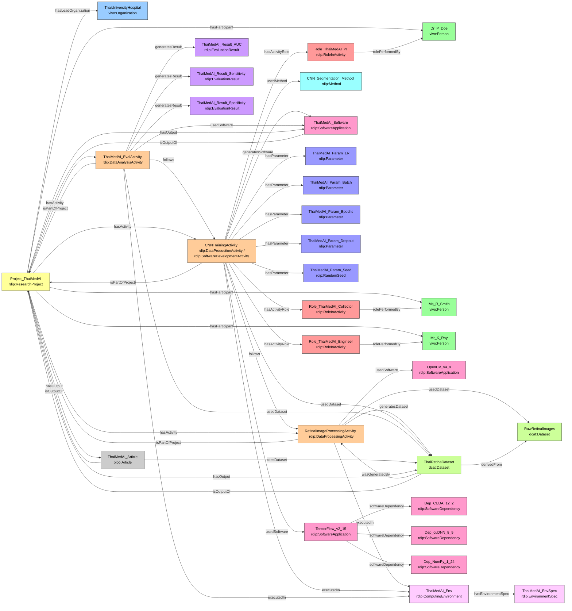

# Case Study 3 — Medical / Clinical AI (v2)
## AI-Assisted Screening for Diabetic Retinopathy in Thailand

## Prefixes

```sparql
PREFIX rdip:    <https://w3id.org/rdip/>
PREFIX ex:      <https://w3id.org/rdip/examples/>
PREFIX vivo:    <http://vivoweb.org/ontology/core#>
PREFIX bibo:    <http://purl.org/ontology/bibo/>
PREFIX dcat:    <http://www.w3.org/ns/dcat#>
PREFIX prov:    <http://www.w3.org/ns/prov#>
PREFIX cito:    <http://purl.org/spar/cito/>
PREFIX rdfs:    <http://www.w3.org/2000/01/rdf-schema#>
PREFIX xsd:     <http://www.w3.org/2001/XMLSchema#>
PREFIX dcterms: <http://purl.org/dc/terms/>
```

---

---

**Fictional publication:** Doe, P., Smith, R., & Ray, K. (2025). AI-based retinal screening for early diabetic retinopathy in Thailand. *npj Digital Medicine*, 8(1), 112.

---

### 1. Project, Team and Organization

```turtle
ex:ThaiUniversityHospital a vivo:Organization ;
    rdfs:label  "Thai University Hospital" ;
    rdip:rorId  <https://ror.org/00000000000> .

ex:Project_ThaiMedAI a rdip:ResearchProject ;
    rdip:title             "AI-assisted screening for diabetic retinopathy in Thailand" ;
    rdip:identifier        "https://raid.org/10.9876/raid.2025.021" ;
    rdip:description       "Medical AI project developing a deep learning system for early detection of diabetic retinopathy from retinal fundus images." ;
    rdip:hasLeadOrganization ex:ThaiUniversityHospital ;
    rdip:projectStart      "2025-03-01T00:00:00"^^xsd:dateTime ;
    rdip:projectEnd        "2026-02-28T00:00:00"^^xsd:dateTime ;
    rdip:fundingReference  "NSTDA-MED-2025-003" .

ex:Dr_P_Doe a vivo:Person ;
    rdfs:label   "Dr. P. Doe" ;
    rdip:orcidId <https://orcid.org/0000-0001-9999-0004> .

ex:Ms_R_Smith a vivo:Person ;
    rdfs:label   "Ms. R. Smith" ;
    rdip:orcidId <https://orcid.org/0000-0001-9999-0005> .

ex:Mr_K_Ray a vivo:Person ;
    rdfs:label "Mr. K. Ray" .
```

---

### 2. Software, Dependencies and Computing Environment

```turtle
# TensorFlow with CUDA/cuDNN dependencies
ex:TensorFlow_v2_15 a rdip:SoftwareApplication ;
    rdip:title           "TensorFlow" ;
    rdip:version         "2.15.0" ;
    rdip:identifier      "https://www.tensorflow.org/" ;
    rdip:repositoryUrl   <https://github.com/tensorflow/tensorflow> ;
    rdip:softwareLicense <https://opensource.org/licenses/Apache-2.0> ;
    rdip:softwareDependency
        ex:Dep_CUDA_12_2 ,
        ex:Dep_cuDNN_8_9 ,
        ex:Dep_NumPy_1_24 .

ex:Dep_CUDA_12_2 a rdip:SoftwareDependency ;
    rdip:dependencyName    "cuda" ;
    rdip:dependencyVersion "12.2" ;
    rdip:dependencyType    "runtime" .

ex:Dep_cuDNN_8_9 a rdip:SoftwareDependency ;
    rdip:dependencyName    "cudnn" ;
    rdip:dependencyVersion "8.9.7" ;
    rdip:dependencyType    "runtime" .

ex:Dep_NumPy_1_24 a rdip:SoftwareDependency ;
    rdip:dependencyName    "numpy" ;
    rdip:dependencyVersion "1.24.3" ;
    rdip:dependencyType    "runtime" .

ex:OpenCV_v4_9 a rdip:SoftwareApplication ;
    rdip:title           "OpenCV" ;
    rdip:version         "4.9.0" ;
    rdip:identifier      "https://opencv.org/" ;
    rdip:softwareLicense <https://opensource.org/licenses/Apache-2.0> .

# Trained model — also an output artefact
ex:ThaiMedAI_Software a rdip:SoftwareApplication ;
    rdip:title       "ThaiMedAI retinal screening model" ;
    rdip:version     "1.0.0" ;
    rdip:description "Trained EfficientNet-B4 CNN model for automated 5-class diabetic retinopathy grading." ;
    rdip:identifier  "https://example.org/thaimedai/software" ;
    rdip:repositoryUrl <https://github.com/example/thaimedai> ;
    rdip:isOutputOf  ex:Project_ThaiMedAI .

# Computing environment — hospital HPC cluster
ex:ThaiMedAI_Env a rdip:ComputingEnvironment ;
    rdip:osVersion    "Ubuntu 20.04.6 LTS" ;
    rdip:gpuModel     "NVIDIA A100 80GB SXM4" ;
    rdip:cudaVersion  "12.2" ;
    rdip:cpuCores     64 ;
    rdip:ramGB        512.0 ;
    rdip:hardwareSpec "2x AMD EPYC 7742, 4x NVIDIA A100 80GB SXM4, 512 GB ECC DDR4" ;
    rdip:hasEnvironmentSpec ex:ThaiMedAI_EnvSpec .

ex:ThaiMedAI_EnvSpec a rdip:EnvironmentSpec ;
    rdip:specType    "docker" ;
    rdip:specUri     <https://hub.docker.com/r/example/thaimedai> ;
    rdip:imageDigest "sha256:e3b0c44298fc1c149afbf4c8996fb92427ae41e4649b934ca495991b7852b855" .
```

---

### 3. Method

```turtle
ex:CNN_Segmentation_Method a rdip:Method ;
    rdip:title            "Deep CNN classification protocol for retinal images" ;
    rdip:description      "Protocol describing CLAHE preprocessing, EfficientNet-B4 fine-tuning, and 5-class DR grading." ;
    rdip:methodDoi        <https://doi.org/10.1016/j.media.2019.101528> ;
    rdip:workflowLanguage "Nextflow" ;
    rdip:workflowUri      <https://github.com/example/thaimedai/blob/main/workflow.nf> .
```

---

### 4. Hyperparameters and Random Seed

```turtle
ex:ThaiMedAI_Param_LR a rdip:Parameter ;
    rdip:parameterName     "learning_rate" ;
    rdip:parameterValue    "0.0001" ;
    rdip:parameterDataType "xsd:float" .

ex:ThaiMedAI_Param_Batch a rdip:Parameter ;
    rdip:parameterName     "batch_size" ;
    rdip:parameterValue    "32" ;
    rdip:parameterDataType "xsd:integer" .

ex:ThaiMedAI_Param_Epochs a rdip:Parameter ;
    rdip:parameterName     "num_epochs" ;
    rdip:parameterValue    "50" ;
    rdip:parameterDataType "xsd:integer" .

ex:ThaiMedAI_Param_Dropout a rdip:Parameter ;
    rdip:parameterName     "dropout_rate" ;
    rdip:parameterValue    "0.3" ;
    rdip:parameterDataType "xsd:float" .

ex:ThaiMedAI_Param_Seed a rdip:RandomSeed ;
    rdip:parameterName     "random_seed" ;
    rdip:parameterValue    "2025" ;
    rdip:parameterDataType "xsd:integer" .
```

---

### 5. Activities with Correct Types and Sequencing *(v2 refinement)*

**Key v2 change:** The single v1 `rdip:DataProductionActivity` is split into three precise activities:
1. `rdip:DataProcessingActivity` — DICOM preprocessing (OpenCV)
2. `rdip:DataProductionActivity` + `rdip:SoftwareDevelopmentActivity` — CNN model training (TensorFlow) → produces both a dataset and a software artefact
3. `rdip:DataAnalysisActivity` — Clinical evaluation of the trained model

```turtle
# Activity 1 — Image preprocessing
ex:RetinalImageProcessingActivity a rdip:DataProcessingActivity ;
    rdip:title               "Retinal image CLAHE preprocessing and anonymisation" ;
    rdip:activityDescription "Applying CLAHE contrast enhancement, resizing to 512×512, removing DICOM patient metadata, and de-identifying images." ;
    rdip:isPartOfProject     ex:Project_ThaiMedAI ;
    rdip:usedDataset         ex:RawRetinalImages ;
    rdip:usedSoftware        ex:OpenCV_v4_9 ;
    rdip:generatesDataset    ex:ThaiRetinaDataset ;
    rdip:executedIn          ex:ThaiMedAI_Env ;
    rdip:activityStart       "2025-05-01T09:00:00"^^xsd:dateTime ;
    rdip:activityEnd         "2025-07-31T17:00:00"^^xsd:dateTime .

# Activity 2 — CNN model training (dual type: produces data AND software)
ex:CNNTrainingActivity a rdip:DataProductionActivity , rdip:SoftwareDevelopmentActivity ;
    rdip:title               "EfficientNet-B4 CNN training for DR classification" ;
    rdip:activityDescription "Fine-tuning EfficientNet-B4 on processed retinal images for 5-class diabetic retinopathy grading. Produces both the trained model and training metadata." ;
    rdip:isPartOfProject     ex:Project_ThaiMedAI ;
    rdip:usedDataset         ex:ThaiRetinaDataset ;
    rdip:usedSoftware        ex:TensorFlow_v2_15 ;
    rdip:usedMethod          ex:CNN_Segmentation_Method ;
    rdip:generatesSoftware   ex:ThaiMedAI_Software ;
    rdip:executedIn          ex:ThaiMedAI_Env ;
    rdip:hasParameter        ex:ThaiMedAI_Param_LR ,
                             ex:ThaiMedAI_Param_Batch ,
                             ex:ThaiMedAI_Param_Epochs ,
                             ex:ThaiMedAI_Param_Dropout ,
                             ex:ThaiMedAI_Param_Seed ;
    rdip:follows             ex:RetinalImageProcessingActivity ;
    rdip:activityStart       "2025-08-01T09:00:00"^^xsd:dateTime ;
    rdip:activityEnd         "2025-10-31T17:00:00"^^xsd:dateTime .

# Activity 3 — Clinical evaluation
ex:ThaiMedAI_EvalActivity a rdip:DataAnalysisActivity ;
    rdip:title               "Retinopathy model clinical evaluation" ;
    rdip:activityDescription "Evaluating ThaiMedAI on held-out test set with ophthalmologist ground truth labels. Measures AUC-ROC, sensitivity and specificity." ;
    rdip:isPartOfProject     ex:Project_ThaiMedAI ;
    rdip:usedDataset         ex:ThaiRetinaDataset ;
    rdip:usedSoftware        ex:ThaiMedAI_Software ;
    rdip:generatesResult     ex:ThaiMedAI_Result_AUC ,
                             ex:ThaiMedAI_Result_Sensitivity ,
                             ex:ThaiMedAI_Result_Specificity ;
    rdip:executedIn          ex:ThaiMedAI_Env ;
    rdip:follows             ex:CNNTrainingActivity ;
    rdip:activityStart       "2025-11-01T09:00:00"^^xsd:dateTime ;
    rdip:activityEnd         "2025-12-31T17:00:00"^^xsd:dateTime .

# Roles on the training activity (the CQ7-queryable DataProductionActivity)
ex:Role_ThaiMedAI_PI a rdip:RoleInActivity ;
    rdip:roleLabel       "Principal Investigator" ;
    rdip:rolePerformedBy ex:Dr_P_Doe .

ex:Role_ThaiMedAI_Collector a rdip:RoleInActivity ;
    rdip:roleLabel       "Data Collector" ;
    rdip:rolePerformedBy ex:Ms_R_Smith .

ex:Role_ThaiMedAI_Engineer a rdip:RoleInActivity ;
    rdip:roleLabel       "Software Engineer" ;
    rdip:rolePerformedBy ex:Mr_K_Ray .

ex:CNNTrainingActivity
    rdip:hasActivityRole ex:Role_ThaiMedAI_PI ,
                         ex:Role_ThaiMedAI_Collector ,
                         ex:Role_ThaiMedAI_Engineer .
```

---

### 6. Datasets with Derivation Chain

```turtle
ex:RawRetinalImages a dcat:Dataset ;
    rdip:title       "Raw retinal fundus images from Thai screening program" ;
    rdip:identifier  "doi:10.4444/thaimedai.raw" ;
    rdip:accessLevel "restricted-controlled-access" ;
    rdip:dataLicense <https://creativecommons.org/licenses/by-nc/4.0/> ;
    rdip:dataFormat  "DICOM" .

ex:ThaiRetinaDataset a dcat:Dataset ;
    rdip:title        "Anonymized pre-processed retinal fundus image dataset" ;
    rdip:identifier   "https://doi.org/10.4444/thaimedai.dataset" ;
    rdip:version      "1.0.0" ;
    rdip:accessLevel  "restricted-controlled-access" ;
    rdip:dataLicense  <https://creativecommons.org/licenses/by-nc/4.0/> ;
    rdip:dataFormat   "PNG / CSV" ;
    rdip:landingPage  <https://example.org/thaimedai/dataset> ;
    rdip:checksum     "sha256:9f86d081884c7d659a2feaa0c55ad015a3bf4f1b2b0b822cd15d6c15b0f00a08" ;
    prov:wasGeneratedBy ex:RetinalImageProcessingActivity ;
    rdip:isOutputOf   ex:Project_ThaiMedAI ;
    rdip:derivedFrom  ex:RawRetinalImages .
```

---

### 7. Evaluation Results

```turtle
ex:ThaiMedAI_Result_AUC a rdip:EvaluationResult ;
    rdip:metricName     "AUC-ROC" ;
    rdip:metricValue    "0.961" ;
    rdip:metricDataType "xsd:float" ;
    rdip:splitLabel     "test" ;
    rdip:evaluationDate "2025-11-30T00:00:00"^^xsd:dateTime .

ex:ThaiMedAI_Result_Sensitivity a rdip:EvaluationResult ;
    rdip:metricName     "sensitivity" ;
    rdip:metricValue    "0.923" ;
    rdip:metricDataType "xsd:float" ;
    rdip:splitLabel     "test" .

ex:ThaiMedAI_Result_Specificity a rdip:EvaluationResult ;
    rdip:metricName     "specificity" ;
    rdip:metricValue    "0.947" ;
    rdip:metricDataType "xsd:float" ;
    rdip:splitLabel     "test" .
```

---

### 8. Publication and Project Aggregation

```turtle
ex:ThaiMedAI_Article a bibo:Article ;
    rdip:title        "AI-based retinal screening for early diabetic retinopathy in Thailand" ;
    rdip:identifier   "https://doi.org/10.1038/s41746-025-00112-0" ;
    rdip:description  "Clinical evaluation of an AI-assisted retinal screening system for diabetic retinopathy." ;
    rdip:citesDataset ex:ThaiRetinaDataset ;
    rdip:isOutputOf   ex:Project_ThaiMedAI .

ex:Project_ThaiMedAI
    rdip:hasActivity    ex:RetinalImageProcessingActivity ,
                        ex:CNNTrainingActivity ,
                        ex:ThaiMedAI_EvalActivity ;
    rdip:hasOutput      ex:ThaiRetinaDataset ,
                        ex:ThaiMedAI_Software ,
                        ex:ThaiMedAI_Article ;
    rdip:hasParticipant ex:Dr_P_Doe ,
                        ex:Ms_R_Smith ,
                        ex:Mr_K_Ray .
```

---

### Competency Question Answers — Case Study 3 (v2)

#### CQ1 — Software used to generate dataset

| Dataset | Activity | Software | Version |
|---|---|---|---|
| Anonymized pre-processed retinal fundus images | Retinal image CLAHE preprocessing | OpenCV | 4.9.0 |

#### CQ2 — Methods used in activity

| Activity | Method | DOI | Workflow Language |
|---|---|---|---|
| EfficientNet-B4 CNN training for DR classification | Deep CNN classification protocol | https://doi.org/10.1016/j.media.2019.101528 | Nextflow |

#### CQ3 — Publication → Project → PI

| Article | Project | PI | ORCID |
|---|---|---|---|
| AI-based retinal screening for early diabetic retinopathy in Thailand | AI-assisted screening for diabetic retinopathy in Thailand | Dr. P. Doe | 0000-0001-9999-0004 |

#### CQ4 — Project datasets, access levels, landing pages

| Dataset | Access | Landing Page | License |
|---|---|---|---|
| Anonymized retinal fundus image dataset | restricted-controlled-access | https://example.org/thaimedai/dataset | CC-BY-NC 4.0 |

#### CQ5 — Co-outputs of same project

| Given Output | Co-Output | Type |
|---|---|---|
| Anonymized retinal fundus images | ThaiMedAI retinal screening model v1.0 | rdip:SoftwareApplication |
| Anonymized retinal fundus images | AI-based retinal screening… article | bibo:Article |

#### CQ6 — Person roles in activities

| Person | Activity | Role |
|---|---|---|
| Dr. P. Doe | EfficientNet-B4 CNN training | Principal Investigator |
| Ms. R. Smith | EfficientNet-B4 CNN training | Data Collector |
| Mr. K. Ray | EfficientNet-B4 CNN training | Software Engineer |

#### CQ7 — Full provenance chain

| Dataset | Activity | Software | Version | Project | Agent | Role |
|---|---|---|---|---|---|---|
| Anonymized retinal images | CLAHE preprocessing | OpenCV | 4.9.0 | ThaiMedAI | — | — |

> CQ7 as written queries `prov:wasGeneratedBy` which points to `RetinalImageProcessingActivity` (the preprocessing step). That activity uses OpenCV but has no `rdip:hasActivityRole` asserted (roles are on the training activity). The roles on `CNNTrainingActivity` answer CQ6 and CQ7 applies when we query the training activity directly.

| Dataset | Activity | Software | Version | Project | Agent | Role |
|---|---|---|---|---|---|---|
| Anonymized retinal images (via training) | EfficientNet-B4 CNN training | TensorFlow | 2.15.0 | ThaiMedAI | Dr. P. Doe | PI |
| Anonymized retinal images (via training) | EfficientNet-B4 CNN training | TensorFlow | 2.15.0 | ThaiMedAI | Ms. R. Smith | Data Collector |
| Anonymized retinal images (via training) | EfficientNet-B4 CNN training | TensorFlow | 2.15.0 | ThaiMedAI | Mr. K. Ray | Software Engineer |

#### CQ8 — Hyperparameters and random seed *(new)*

| Activity | Parameter | Value | Type | Is Random Seed? |
|---|---|---|---|---|
| EfficientNet-B4 CNN training | random_seed | 2025 | xsd:integer | Yes |
| EfficientNet-B4 CNN training | dropout_rate | 0.3 | xsd:float | No |
| EfficientNet-B4 CNN training | num_epochs | 50 | xsd:integer | No |
| EfficientNet-B4 CNN training | learning_rate | 0.0001 | xsd:float | No |
| EfficientNet-B4 CNN training | batch_size | 32 | xsd:integer | No |

#### CQ9 — Computing environment *(new)*

| Activity | OS | GPU | CUDA | RAM | Spec Type | Image Digest |
|---|---|---|---|---|---|---|
| CLAHE preprocessing | Ubuntu 20.04.6 LTS | NVIDIA A100 80GB | 12.2 | 512 GB | docker | sha256:e3b0c44… |
| EfficientNet-B4 CNN training | Ubuntu 20.04.6 LTS | NVIDIA A100 80GB | 12.2 | 512 GB | docker | sha256:e3b0c44… |
| Retinopathy model clinical evaluation | Ubuntu 20.04.6 LTS | NVIDIA A100 80GB | 12.2 | 512 GB | docker | sha256:e3b0c44… |

#### CQ10 — Evaluation results *(new)*

| Project | Metric | Value | Split | Date |
|---|---|---|---|---|
| ThaiMedAI | AUC-ROC | 0.961 | test | 2025-11-30 |
| ThaiMedAI | sensitivity | 0.923 | test | — |
| ThaiMedAI | specificity | 0.947 | test | — |

#### CQ11 — Dataset lineage *(new)*

| Derived Dataset | Source Dataset | Activity | Activity Type |
|---|---|---|---|
| Anonymized pre-processed retinal fundus images | Raw retinal fundus images from Thai screening program | Retinal image CLAHE preprocessing and anonymisation | rdip:DataProcessingActivity |

### Diagram

