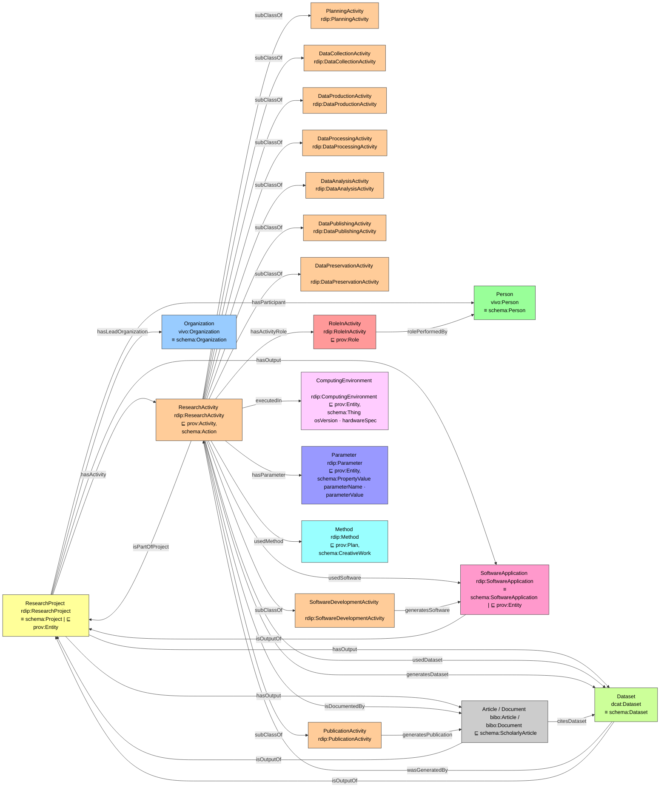

## Ontology Diagram

```mermaid
graph LR
    classDef project fill:#ffff99,stroke:#333,color:#000000;
    classDef activity fill:#ffcc99,stroke:#333,color:#000000;
    classDef person fill:#99ff99,stroke:#333,color:#000000;
    classDef org fill:#99ccff,stroke:#333,color:#000000;
    classDef software fill:#ff99cc,stroke:#333,color:#000000;
    classDef dataset fill:#ccff99,stroke:#333,color:#000000;
    classDef method fill:#99ffff,stroke:#333,color:#000000;
    classDef role fill:#ff9999,stroke:#333,color:#000000;
    classDef article fill:#cccccc,stroke:#333,color:#000000;
    classDef param fill:#9999ff,stroke:#333,color:#000000;
    classDef env fill:#ffccff,stroke:#333,color:#000000;

    %% ── PROJECT ──
    ResearchProject["ResearchProject </br> rdip:ResearchProject </br> ≡ schema:Project | ⊑ prov:Entity"]:::project

    %% ── ACTIVITY HIERARCHY ──
    ResearchActivity["ResearchActivity </br> rdip:ResearchActivity </br> ⊑ prov:Activity, schema:Action"]:::activity
    PlanningActivity["PlanningActivity </br> rdip:PlanningActivity"]:::activity
    DataCollectionActivity["DataCollectionActivity </br> rdip:DataCollectionActivity"]:::activity
    DataProductionActivity["DataProductionActivity </br> rdip:DataProductionActivity"]:::activity
    DataProcessingActivity["DataProcessingActivity </br> rdip:DataProcessingActivity"]:::activity
    DataAnalysisActivity["DataAnalysisActivity </br> rdip:DataAnalysisActivity"]:::activity
    DataPublishingActivity["DataPublishingActivity </br> rdip:DataPublishingActivity"]:::activity
    DataPreservationActivity["DataPreservationActivity </br> rdip:DataPreservationActivity"]:::activity
    PublicationActivity["PublicationActivity </br> rdip:PublicationActivity"]:::activity
    SoftwareDevelopmentActivity["SoftwareDevelopmentActivity </br> rdip:SoftwareDevelopmentActivity"]:::activity

    %% ── ACTIVITY SUBCLASS HIERARCHY ──
    ResearchActivity -- subClassOf --> PlanningActivity
    ResearchActivity -- subClassOf --> DataCollectionActivity
    ResearchActivity -- subClassOf --> DataProductionActivity
    ResearchActivity -- subClassOf --> DataProcessingActivity
    ResearchActivity -- subClassOf --> DataAnalysisActivity
    ResearchActivity -- subClassOf --> DataPublishingActivity
    ResearchActivity -- subClassOf --> DataPreservationActivity
    ResearchActivity -- subClassOf --> PublicationActivity
    ResearchActivity -- subClassOf --> SoftwareDevelopmentActivity

    %% ── PEOPLE & ROLES ──
    Person["Person </br> vivo:Person </br> ≡ schema:Person"]:::person
    Organization["Organization </br> vivo:Organization </br> ≡ schema:Organization"]:::org
    RoleInActivity["RoleInActivity </br> rdip:RoleInActivity </br> ⊑ prov:Role"]:::role

    %% ── SOFTWARE ──
    SoftwareApplication["SoftwareApplication </br> rdip:SoftwareApplication </br> ≡ schema:SoftwareApplication | ⊑ prov:Entity"]:::software
    ComputingEnvironment["ComputingEnvironment </br> rdip:ComputingEnvironment </br> ⊑ prov:Entity, schema:Thing"]:::env

    %% ── PARAMETERS ──
    Parameter["Parameter </br> rdip:Parameter </br> ⊑ prov:Entity, schema:PropertyValue </br> parameterName · parameterValue"]:::param
    Method["Method </br> rdip:Method </br> ⊑ prov:Plan, schema:CreativeWork"]:::method

    %% ── DATASETS & PUBLICATIONS ──
    Dataset["Dataset </br> dcat:Dataset </br> ≡ schema:Dataset"]:::dataset
    Article["Article / Document </br> bibo:Article / bibo:Document </br> ⊑ schema:ScholarlyArticle"]:::article

    %% ── PROJECT RELATIONS ──
    ResearchProject -- hasActivity --> ResearchActivity
    ResearchProject -- hasParticipant --> Person
    ResearchProject -- hasLeadOrganization --> Organization
    ResearchProject -- hasOutput --> Dataset
    ResearchProject -- hasOutput --> SoftwareApplication
    ResearchProject -- hasOutput --> Article

    %% ── ACTIVITY RELATIONS ──
    ResearchActivity -- isPartOfProject --> ResearchProject
    ResearchActivity -- usedDataset --> Dataset
    ResearchActivity -- generatesDataset --> Dataset
    ResearchActivity -- usedSoftware --> SoftwareApplication
    ResearchActivity -- usedMethod --> Method
    ResearchActivity -- executedIn --> ComputingEnvironment
    ResearchActivity -- hasParameter --> Parameter
    ResearchActivity -- hasActivityRole --> RoleInActivity
    ResearchActivity -- isDocumentedBy --> Article

    %% ── SPECIALIZED ACTIVITY RELATIONS ──
    SoftwareDevelopmentActivity -- generatesSoftware --> SoftwareApplication
    PublicationActivity -- generatesPublication --> Article

    %% ── ROLE RELATIONS ──
    RoleInActivity -- rolePerformedBy --> Person

    %% ── SOFTWARE RELATIONS ──
    SoftwareApplication -- isOutputOf --> ResearchProject

    %% ── DATASET RELATIONS ──
    Dataset -- wasGeneratedBy --> ResearchActivity
    Dataset -- isOutputOf --> ResearchProject

    %% ── PUBLICATION RELATIONS ──
    Article -- citesDataset --> Dataset
    Article -- isOutputOf --> ResearchProject

    %% ── ENVIRONMENT DATA PROPERTIES ──
    ComputingEnvironment["ComputingEnvironment </br> rdip:ComputingEnvironment </br> ⊑ prov:Entity, schema:Thing </br> osVersion · hardwareSpec"]:::env
```
