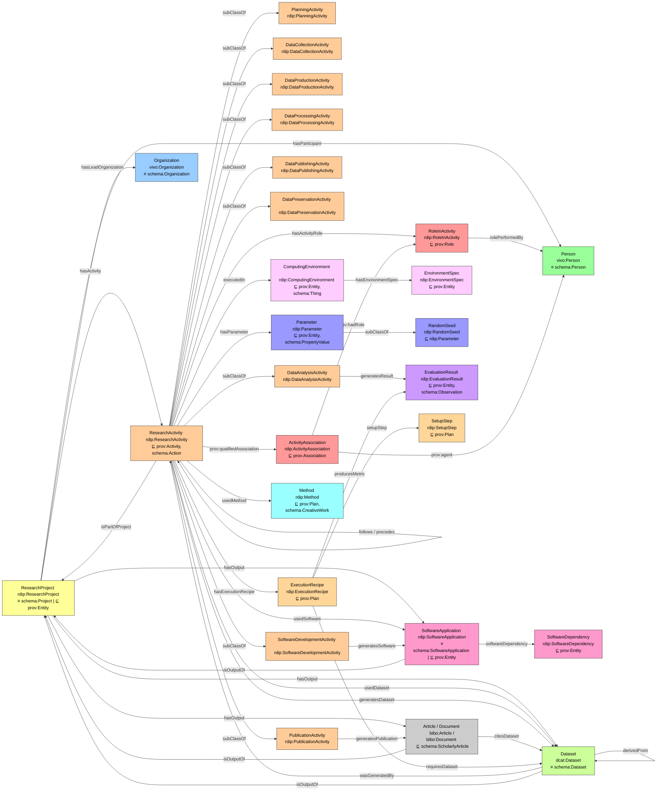

## Ontology Diagram

## v2.1 — Execution Recipes

`rdip:ExecutionRecipe` makes the procedure for reproducing a reported result an
explicit, machine-readable object rather than prose in a README. It is a
`prov:Plan`: the plan an activity follows, not the activity itself.

| Term | Kind | Notes |
|---|---|---|
| `rdip:ExecutionRecipe` | class ⊑ `prov:Plan` | the recipe as a whole |
| `rdip:SetupStep` | class ⊑ `prov:Plan` | one ordered preparatory action |
| `rdip:hasExecutionRecipe` | object property | activity → recipe; shortcut for `prov:qualifiedAssociation`/`prov:hadPlan` |
| `rdip:setupStep` | object property | recipe → step |
| `rdip:requiresDataset` | object property | recipe → `dcat:Dataset` |
| `rdip:producesMetric` | object property | recipe → `rdip:EvaluationResult` |
| `rdip:runCommand` | data property | the command, verbatim |
| `rdip:entryPoint` | data property | script the command invokes |
| `rdip:stepOrder` | data property | 1-based position of a setup step |
| `rdip:stepCommand` | data property | the step's shell command |
| `rdip:requiresCheckpoint` | data property | pretrained weights, path or URL |
| `rdip:recipeConfidence` | data property | `high` or `low`, self-reported by the extractor |

Three modelling choices are deliberate and worth stating:

**Setup steps are a class, not repeated literals.** RDF imposes no order on
repeated properties, and setup order is load-bearing — a download must precede
the extraction that consumes it. `rdip:stepOrder` carries the sequence.

**`requiresDataset` points at a `dcat:Dataset`, not a name.** A requirement that
resolves to a distribution and an access level makes a real blocker visible: a
dataset released only on application defeats reproduction even when the command
is perfect.

**`producesMetric` reuses `rdip:EvaluationResult`** from Section 5 rather than
introducing new metric vocabulary, so comparing a re-run against the paper's
claim is a comparison of two `EvaluationResult` instances.

A recipe whose `rdip:runCommand` still contains an unfilled placeholder should be
recorded verbatim with a low `rdip:recipeConfidence`, never repaired by guessing
a value: a fabricated path converts a detectable documentation gap into a silent
wrong answer. See `core/examples.ttl`, case study 4, for a real extracted recipe.
